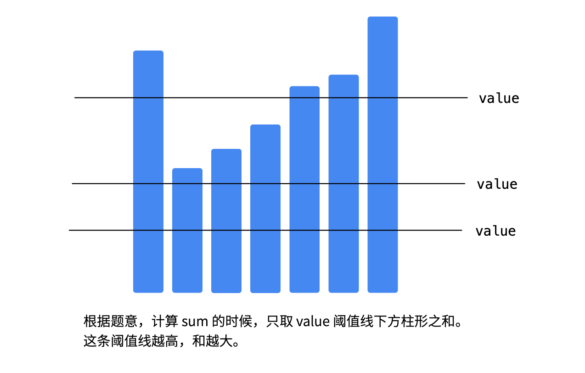
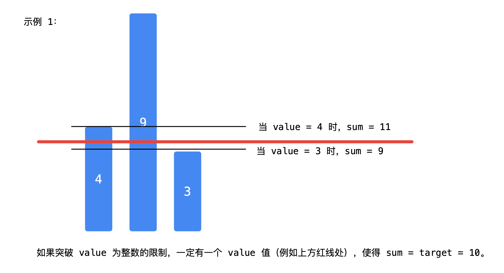

#### 1300. 转变数组后最接近目标值的数组和

给你一个整数数组 arr 和一个目标值 target ，请你返回一个整数 value ，使得将数组中所有大于 value 的值变成 value 后，数组的和最接近  target （最接近表示两者之差的绝对值最小）。

如果有多种使得和最接近 `target` 的方案，请你返回这些整数中的最小值。

请注意，答案不一定是 `arr` 中的数字。

**示例 1：**

```shell
输入：arr = [4,9,3], target = 10
输出：3
解释：当选择 value 为 3 时，数组会变成 [3, 3, 3]，和为 9 ，这是最接近 target 的方案。
```

**示例 2：**

```shell
输入：arr = [2,3,5], target = 10
输出：5
```

**示例 3：**

```shell
输入：arr = [60864,25176,27249,21296,20204], target = 56803
输出：11361
```

**提示：**

- `1 <= arr.length <= 10^4`
- `1 <= arr[i], target <= 10^5`

### 题解

#### 解题思路：

* 这道题比较麻烦的是求和以后可能不等于 target ，所以让我们求「最接近的方案」。而这个烦人的根源是 value 的取值一定得是整数。正是因为题目说 value 是整数，并且「答案不一定是 arr 中的数字」，因此依然可以使用二分查找法确定这个整数值。



* 做题的时候，会发现判别条件很不好写，因为「怎么衡量接近」，度量这个「最接近」的量不好选。因此需要考虑别的方案；
* 最接近的情况是：选定了一个 value 求和以后，恰恰好等于 target。不过更有可能出现的情况是：value 选得小了，「接近程度」变大，而 value 选得大了，「接近程度」变小，反过来也是有可能的。



- 解决方案是：**把边界的上下方的可能的 `value` 值（一共就两个）都拿出来进行一次比较即可**。

```java
class Solution {
  public int findBestValue(int[] arr, int target) {
        int left = 0;
        int right = 0;
        int N = arr.length;
        for (int i = 0; i < N; i++) {
            right = Math.max(right, arr[i]);
        }
        while (left < right) {
            int mid = left + (right - left) / 2;
            int sum = calculateSum(arr, mid);
            // 计算第 1 个使得转变后数组的和大于等于 target 的阈值 threshold
            if (sum < target) {
                // 严格小于的一定不是解
                left = mid + 1;
            } else {
                right = mid;
            }
        }

        // 比较阈值线分别定在 left - 1 和 left 的时候与 target 的接近程度
        int sum1 = calculateSum(arr, left - 1);
        int sum2 = calculateSum(arr, left);
        if (Math.abs(target - sum1) <= Math.abs(sum2 - target)) {
            return left - 1;
        }
        return left;
    }

    public int calculateSum(int[] arr, int threshold) {
        int sum = 0;
        for (int i = 0; i < arr.length; i++) {
            sum += Math.min(arr[i], threshold);
        }
        return sum;
    }
}
```

