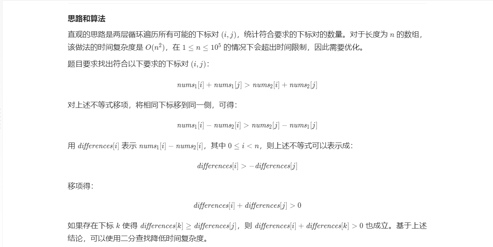

#### 1885. Count Pairs in Two Arrays

Given two integer arrays nums1 and nums2 of length n, count the pairs of indices (i, j) such that i < j and nums1[i] + nums1[j] > nums2[i] + nums2[j].

Return *the **number of pairs** satisfying the condition.*

**Example 1:**

```shell
Input: nums1 = [2,1,2,1], nums2 = [1,2,1,2]
Output: 1
Explanation: The pairs satisfying the condition are:
- (0, 2) where 2 + 2 > 1 + 1.
```

**Example 2:**

```shell
Input: nums1 = [1,10,6,2], nums2 = [1,4,1,5]
Output: 5
Explanation: The pairs satisfying the condition are:
- (0, 1) where 1 + 10 > 1 + 4.
- (0, 2) where 1 + 6 > 1 + 1.
- (1, 2) where 10 + 6 > 4 + 1.
- (1, 3) where 10 + 2 > 4 + 5.
- (2, 3) where 6 + 2 > 1 + 5.
```

**Constraints:**

- `n == nums1.length == nums2.length`
- `1 <= n <= 105`
- `1 <= nums1[i], nums2[i] <= 105`

### 题解

**计算差值后排序并二分查找**




```java
class Solution {
      public long countPairs(int[] nums1, int[] nums2) {
        long ans = 0;
        int n = nums1.length;
        int[] differences = new int[n];
        for (int i = 0; i < n; i++) {
            differences[i] = nums1[i] - nums2[i];
        }
        Arrays.sort(differences);

        for (int i = 0; i < n - 1; i++) {
            int target = -differences[i] + 1;
            int index = binarySearch(differences, n, target, i + 1);
            ans += n - index;
        }
        return ans;
    }

    public int binarySearch(int[] differences, int n, int target, int startIndex) {
        int low = startIndex;
        int high = n - 1;

        if (differences[high] < target) {
            return n;
        }

        while (low < high) {
            int mid = low + (high - low) / 2;
            if (differences[mid] < target) {
                low = mid + 1;
            } else {
                high = mid;
            }
        }
        return low;
    }
}
```

