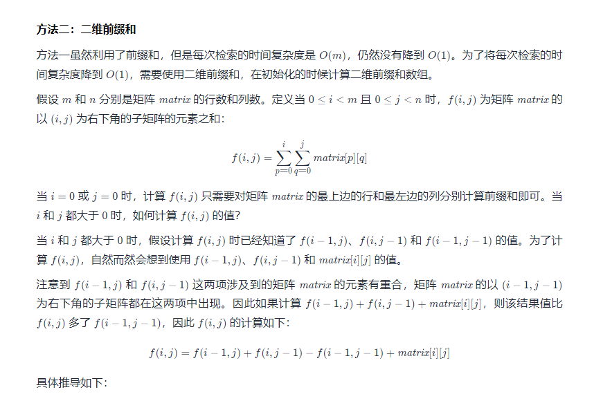
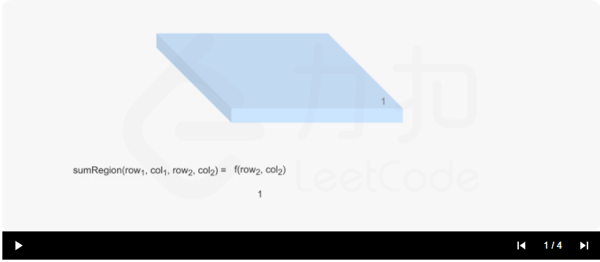
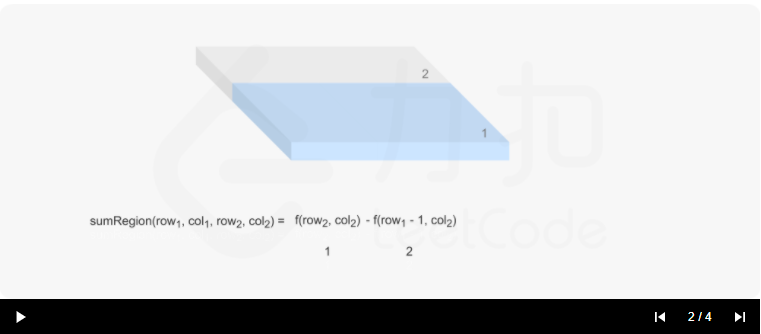
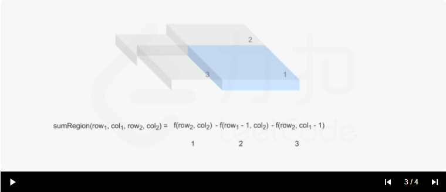
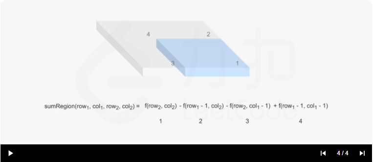

#### 304. 二维区域和检索 - 矩阵不可变

给定一个二维矩阵 `matrix`，以下类型的多个请求：

- 计算其子矩形范围内元素的总和，该子矩阵的 **左上角** 为 `(row1, col1)` ，**右下角** 为 `(row2, col2)` 。

实现 `NumMatrix` 类：

- `NumMatrix(int[][] matrix)` 给定整数矩阵 `matrix` 进行初始化

* `int sumRegion(int row1, int col1, int row2, int col2)` 返回 左上角 `(row1, col1)` 、右下角 `(row2, col2)` 所描述的子矩阵的元素 总和 。

**示例 1：**


```shell
输入: 
["NumMatrix","sumRegion","sumRegion","sumRegion"]
[[[[3,0,1,4,2],[5,6,3,2,1],[1,2,0,1,5],[4,1,0,1,7],[1,0,3,0,5]]],[2,1,4,3],[1,1,2,2],[1,2,2,4]]
输出: 
[null, 8, 11, 12]

解释:
NumMatrix numMatrix = new NumMatrix([[3,0,1,4,2],[5,6,3,2,1],[1,2,0,1,5],[4,1,0,1,7],[1,0,3,0,5]]);
numMatrix.sumRegion(2, 1, 4, 3); // return 8 (红色矩形框的元素总和)
numMatrix.sumRegion(1, 1, 2, 2); // return 11 (绿色矩形框的元素总和)
numMatrix.sumRegion(1, 2, 2, 4); // return 12 (蓝色矩形框的元素总和)
```

**提示：**

* `m == matrix.length`
* `n == matrix[i].length`
* `1 <= m, n <= 200`
* `-105 <= matrix[i][j] <= 105`
* `0 <= row1 <= row2 < m`
* `0 <= col1 <= col2 < n`
* `最多调用 104 次 sumRegion 方法`

### 题解

#### 前言

这道题是「303. 区域和检索 - 数组不可变」的进阶，第 303 题是在一维数组中做区域和检索，这道题是在二维矩阵中做区域和检索。

这道题有两种解法，分别是对每一行计算一维前缀和，以及对整个矩阵计算二维前缀和。


```java
class NumMatrix {
    int[][] sums;

    public NumMatrix(int[][] matrix) {
        int m = matrix.length;
        if (m > 0) {
            int n = matrix[0].length;
            sums = new int[m][n + 1];
            for (int i = 0; i < m; i++) {
                for (int j = 0; j < n; j++) {
                    sums[i][j + 1] = sums[i][j] + matrix[i][j];
                }
            }
        }
    }
    
    public int sumRegion(int row1, int col1, int row2, int col2) {
        int sum = 0;
        for (int i = row1; i <= row2; i++) {
            sum += sums[i][col2 + 1] - sums[i][col1];
        }
        return sum;
    }
}
```





因此在初始化的时候，即可对所有 0≤*i*<*m* 和0≤*j*<*n* 计算得到 f*(*i*,*j) 的值。











```java
public class NumMatrix {

    int[][] sums;

    public NumMatrix(int[][] matrix) {
        int m = matrix.length;
        if (m > 0) {
            int n = matrix[0].length;
            sums = new int[m + 1][n + 1];
            for (int i = 0; i < m; i++) {
                for (int j = 0; j < n; j++) {
                    sums[i + 1][j + 1] = sums[i][j + 1] + sums[i + 1][j] - sums[i][j] + matrix[i][j];
                }
            }
        }
    }

    public int sumRegion(int row1, int col1, int row2, int col2) {
        return sums[row2 + 1][col2 + 1] - sums[row1][col2 + 1] - sums[row2 + 1][col1] + sums[row1][col1];
    }
}
```

