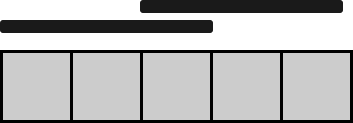

#### [2209. 用地毯覆盖后的最少白色砖块](https://leetcode-cn.com/problems/minimum-white-tiles-after-covering-with-carpets/)

给你一个下标从 **0** 开始的 **二进制** 字符串 `floor` ，它表示地板上砖块的颜色。

- `floor[i] = '0'` 表示地板上第 `i` 块砖块的颜色是 **黑色** 。
- `floor[i] = '1'` 表示地板上第 `i` 块砖块的颜色是 **白色** 。

同时给你 numCarpets 和 carpetLen 。你有 numCarpets 条 黑色 的地毯，每一条 黑色 的地毯长度都为 carpetLen 块砖块。请你使用这些地毯去覆盖砖块，使得未被覆盖的剩余 白色 砖块的数目 最小 。地毯相互之间可以覆盖。

请你返回没被覆盖的白色砖块的 **最少** 数目。

**示例 1：**


```shell
输入：floor = "10110101", numCarpets = 2, carpetLen = 2
输出：2
解释：
上图展示了剩余 2 块白色砖块的方案。
没有其他方案可以使未被覆盖的白色砖块少于 2 块。
```

**示例 2：**



```shell
输入：floor = "11111", numCarpets = 2, carpetLen = 3
输出：0
解释：
上图展示了所有白色砖块都被覆盖的一种方案。
注意，地毯相互之间可以覆盖。
```

**提示：**

* 1 <= carpetLen <= floor.length <= 1000

* floor[i] 要么是 '0' ，要么是 '1' 。

* 1 <= numCarpets <= 1000

### 题解

**动态规划**

```java
class Solution {
    // dp[i][j]表示使用i条地毯覆盖前j块砖,剩余最少的白色砖块
    public int minimumWhiteTiles(String floor, int n, int carpetLen) {
        int m = floor.length();
        int[][] dp = new int[n+1][m];
        for (int i = 0; i < m; i++) {
            if (i == 0) {
                dp[0][i] = floor.charAt(i) % 2;
            } else {
                dp[0][i] = dp[0][i - 1] + floor.charAt(i) % 2;
            }
        }

        for (int i = 1; i <= n; i++) {
            for (int j = 0; j < m; j++) {
                if (j < carpetLen) {
                    dp[i][j] = 0;
                } else {
                    dp[i][j] = Math.min(dp[i][j - 1] + floor.charAt(j) % 2, dp[i - 1][j - carpetLen]);
                }
            }
        }
        return dp[n][m - 1];
    }
}
```
