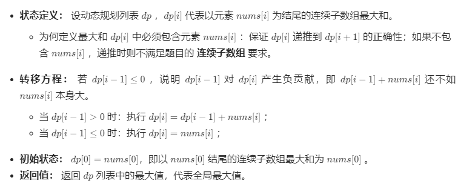

#### 剑指 Offer 42. 连续子数组的最大和

输入一个整型数组，数组中的一个或连续多个整数组成一个子数组。求所有子数组的和的最大值。

要求时间复杂度为O(n)。

**示例1:**

```shell
输入: nums = [-2,1,-3,4,-1,2,1,-5,4]
输出: 6
解释: 连续子数组 [4,-1,2,1] 的和最大，为 6。
```

**提示：**

- `1 <= arr.length <= 10^5`
- `-100 <= arr[i] <= 100`

### 题解

##### 动态规划解析：




**复杂度分析：**

- **时间复杂度 O(N) ：** 线性遍历数组 nums 即可获得结果，使用 O(N) 时间。
- **空间复杂度 O(N) **

```java
class Solution {
    public int maxSubArray(int[] nums) {
        int n = nums.length;
        int ans = nums[0];
        int[] dp = new int[n];
        dp[0] = ans;
        for (int i = 1; i < nums.length; i++) {
            dp[i] = nums[i] + Math.max(dp[i - 1], 0);
            ans = Math.max(ans, dp[i]);
        }
        return ans;
    }
}
```

