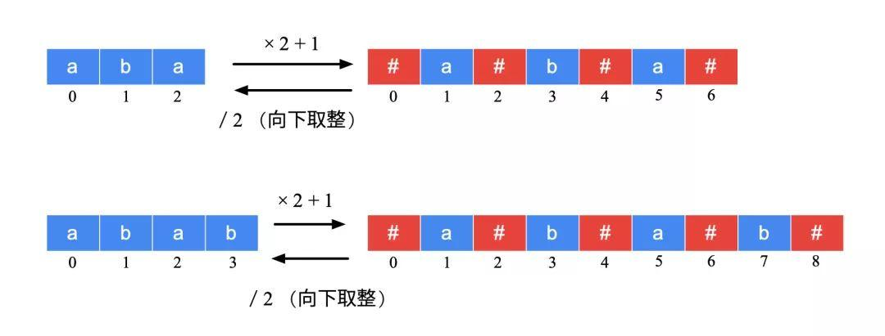
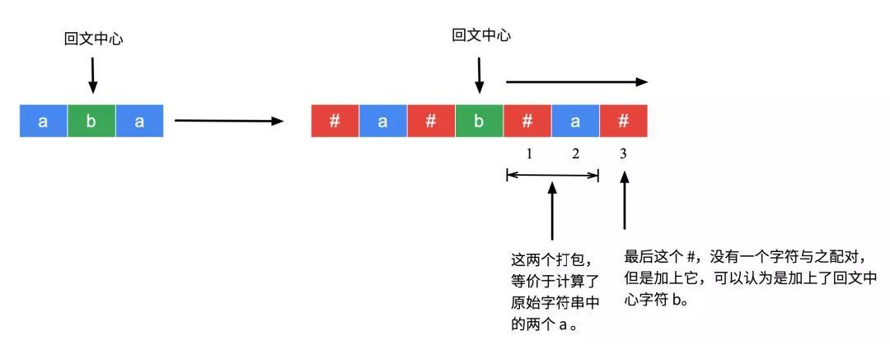
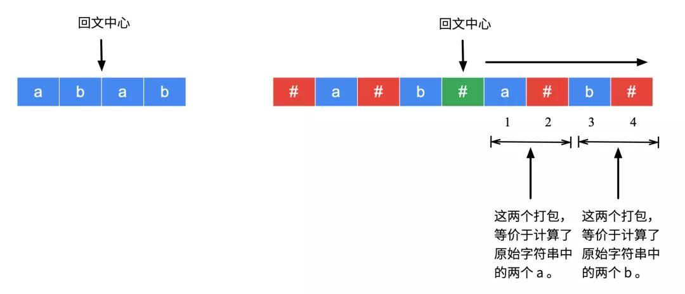
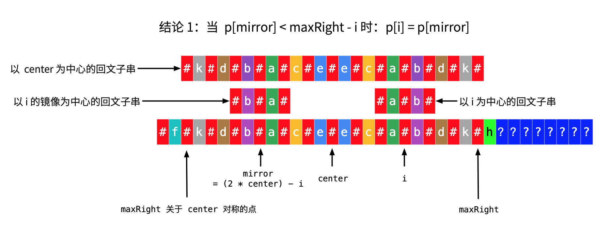
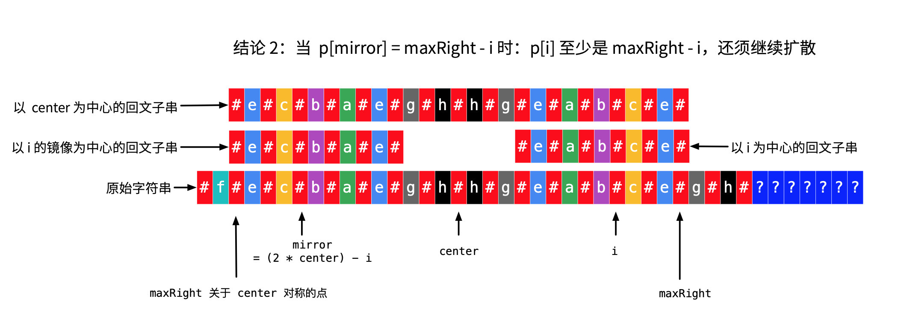

#### 5. 最长回文子串

给你一个字符串 `s`，找到 `s` 中最长的回文子串。

**示例 1：**

```shell
输入：s = "babad"
输出："bab"
解释："aba" 同样是符合题意的答案。
```

**示例 2：**

```shell
输入：s = "cbbd"
输出："bb"
```

**示例 3：**

```shell
输入：s = "a"
输出："a"
```

**示例 4：**

```shell
输入：s = "ac"
输出："a"
```

**提示：**

- `1 <= s.length <= 1000`
- `s` 仅由数字和英文字母（大写和/或小写）组成

### 题解

### 方法一：暴力解法

* 根据回文子串的定义，枚举所有长度大于等于 2 的子串，依次判断它们是否是回文；
* 可以只针对大于「当前得到的最长回文子串长度」的子串进行回文验证；
* 当得到了一个更长的回文时，不需要真的做截取。只需要记录「当前子串的起始位置」和「子串长度」。

```java
public class Solution {

    public String longestPalindrome(String s) {
        int len = s.length();
        if (len < 2) {
            return s;
        }

        int maxLen = 1;
        int begin = 0;
        // s.charAt(i) 每次都会检查数组下标越界，因此先转换成字符数组
        char[] charArray = s.toCharArray();

        // 枚举所有长度大于 1 的子串 charArray[i..j]
        for (int i = 0; i < len - 1; i++) {
            for (int j = i + 1; j < len; j++) {
                if (j - i + 1 > maxLen && validPalindromic(charArray, i, j)) {
                    maxLen = j - i + 1;
                    begin = i;
                }
            }
        }
        return s.substring(begin, begin + maxLen);
    }

    /**
     * 验证子串 s[left..right] 是否为回文串
     */
    private boolean validPalindromic(char[] charArray, int left, int right) {
        while (left < right) {
            if (charArray[left] != charArray[right]) {
                return false;
            }
            left++;
            right--;
        }
        return true;
    }
}
```


### 方法二：动态规划

回文天然具有「状态转移」性质：一个长度严格大于 2 的回文去掉头尾字符以后，剩下的部分依然是回文。反之，如果一个字符串头尾两个字符都不相等，那么这个字符串一定不是回文。「动态规划」的方法根据这样的性质得到。

#### 第 1 步：定义状态

`dp[i][j]` 表示：子串 `s[i..j]` 是否为回文子串，这里子串 `s[i..j]` 定义为左闭右闭区间，即可以取到 `s[i]` 和 `s[j]`。

#### 第 2 步：思考状态转移方程

根据头尾字符是否相等，需要分类讨论：

```shell
dp[i][j] = (s[i] == s[j]) and dp[i + 1][j - 1]
```

**说明**：

* 「动态规划」的「自底向上」求解问题的思路，很多时候是在填写一张二维表格。由于 s[i..j] 表示 s 的一个子串，因此 i 和 j 的关系是 i <= j，只需要填这张表格对角线以上的部分；
* 看到 dp[i + 1] [j - 1] 就需要考虑特殊情况：如果去掉 s[i..j] 头尾两个字符子串 s[i + 1..j - 1] 的长度严格小于 2（不构成区间），即 j - 1 - (i + 1) + 1 < 2 时，整理得 j - i < 3，此时 s[i..j] 是否是回文只取决于 s[i] 与 s[j] 是否相等。结论也比较直观：j - i < 3等价于 j - i + 1 < 4，即当子串 s[i..j]的长度等于 2 或者等于 3 的时候，s[i..j] 是否是回文由 s[i] 与 s[j] 是否相等决定。


#### 第 3 步：考虑初始化

单个字符一定是回文串，因此把对角线先初始化为 true，即 dp[i] [i] = true。根据第 2 步的说明：当 s[i..j] 的长度为 2 时，只需要判断 s[i] 是否等于 s[j]，所以二维表格对角线上的数值不会被参考。所以不设置 dp[i] [i] = true 也能得到正确结论。

#### 第 4 步：考虑输出

一旦得到 `dp[i][j] = true`，就记录子串的「长度」和「起始位置」。没有必要截取，这是因为截取字符串也有性能消耗。

```java
public class Solution {

    public String longestPalindrome(String s) {
        // 特殊用例判断
        int len = s.length();
        if (len < 2) {
            return s;
        }

        int maxLen = 1;
        int begin = 0;

        // dp[i][j] 表示 s[i, j] 是否是回文串
        boolean[][] dp = new boolean[len][len];
        char[] charArray = s.toCharArray();

        // 不设置 dp[i] [i] = true 也能得到正确结论
        //for (int i = 0; i < len; i++) {
        //    dp[i][i] = true;
        //}
        
        for (int j = 1; j < len; j++) {
            for (int i = 0; i < j; i++) {
                if (charArray[i] != charArray[j]) {
                    dp[i][j] = false;
                } else {
                    if (j - i < 3) {
                        dp[i][j] = true;
                    } else {
                        dp[i][j] = dp[i + 1][j - 1];
                    }
                }

                // 只要 dp[i][j] == true 成立，就表示子串 s[i..j] 是回文，此时记录回文长度和起始位置
                if (dp[i][j] && j - i + 1 > maxLen) {
                    maxLen = j - i + 1;
                    begin = i;
                }
            }
        }
        return s.substring(begin, begin + maxLen);
    }
}
```


「暴力法」和「动态规划」枚举了字符串的左右边界，我们还可以 **枚举可能出现的回文子串的「中心位置」，从「中心位置」尝试尽可能向两边，得到回文串**。


### 方法三：中心扩散法

#### 第 1 步：预处理

第一步是对原始字符串进行预处理，也就是 **添加分隔符** 。

首先在字符串的首尾、相邻的字符中插入分隔符，例如 `"babad"` 添加分隔符 `"#"` 以后得到 `"#b#a#b#a#d#"`。

对这一点有如下说明：

1、分隔符是一个字符，种类也只有一个，并且这个字符一定不能是原始字符串中出现过的字符；

2、加入了分隔符以后，使得“间隙”有了具体的位置，方便后续的讨论，并且**新字符串中的任意一个回文子串在原始字符串中一定能找到唯一的一个回文子串与之对应**，因此对新字符串的回文子串的研究就能得到原始字符串的回文子串；

3、新字符串的回文子串的长度一定是奇数；

4、新字符串的回文子串一定以分隔符作为两边的边界，因此分隔符起到“哨兵”的作用。



#### 第 2 步：计算辅助数组 p

辅助数组 `p` 记录了新字符串中以每个字符为中心的回文子串的信息。

手动的计算方法仍然是“中心扩散法”，此时记录以当前字符为中心，向左右两边同时扩散，记录能够扩散的最大步数。

以字符串 `"abbabb"` 为例，说明如何手动计算得到辅助数组 `p` ，我们要填的就是下面这张表。

| **Char**  | **#** | **A** | **#** | **B** | **#** | **B** | **#** | **A** | **#** | **B** | **#** | **B** | **#** |
| :-------- | :---- | :---- | :---- | :---- | :---- | :---- | :---- | :---- | :---- | :---- | :---- | :---- | :---- |
| **index** | 0     | 1     | 2     | 3     | 4     | 5     | 6     | 7     | 8     | 9     | 10    | 11    | 12    |
| **p**     |       |       |       |       |       |       |       |       |       |       |       |       |       |

第 1 行数组 `char` ：原始字符串**加上分隔符以后**的每个字符。

第 2 行数组 `index` ：这个数组是新字符串的索引数组，它的值是从 0 开始的索引编号。

* 我们首先填 `p[0]`。

以 `char[0] = '#'` 为中心，同时向左边向右扩散，走 1 步就碰到边界了，因此能扩散的步数为 0，因此 `p[0] = 0`；

| **Char**  | **#** | **A** | **#** | **B** | **#** | **B** | **#** | **A** | **#** | **B** | **#** | **B** | **#** |
| :-------- | :---- | :---- | :---- | :---- | :---- | :---- | :---- | :---- | :---- | :---- | :---- | :---- | :---- |
| **index** | 0     | 1     | 2     | 3     | 4     | 5     | 6     | 7     | 8     | 9     | 10    | 11    | 12    |
| **p**     | **0** |       |       |       |       |       |       |       |       |       |       |       |       |

* 下面填写 `p[1]` 。

以 `char[1] = 'A'` 为中心，同时向左边向右扩散，走 1 步，左右都是 `"#"`，构成回文子串，于是再继续同时向左边向右边扩散，左边就碰到边界了，最多能扩散的步数”为 1，因此 `p[1] = 1`；

| **Char**  | **#** | **A** | **#** | **B** | **#** | **B** | **#** | **A** | **#** | **B** | **#** | **B** | **#** |
| :-------- | :---- | :---- | :---- | :---- | :---- | :---- | :---- | :---- | :---- | :---- | :---- | :---- | :---- |
| **index** | 0     | 1     | 2     | 3     | 4     | 5     | 6     | 7     | 8     | 9     | 10    | 11    | 12    |
| **p**     | 0     | **1** |       |       |       |       |       |       |       |       |       |       |       |

* 下面填写 `p[2]` 。

以 `char[2] = '#'` 为中心，同时向左边向右扩散，走 1 步，左边是 `"a"`，右边是 `"b"`，不匹配，最多能扩散的步数为 0，因此 `p[2] = 0`；

| **Char**  | **#** | **A** | **#** | **B** | **#** | **B** | **#** | **A** | **#** | **B** | **#** | **B** | **#** |
| :-------- | :---- | :---- | :---- | :---- | :---- | :---- | :---- | :---- | :---- | :---- | :---- | :---- | :---- |
| **index** | 0     | 1     | 2     | 3     | 4     | 5     | 6     | 7     | 8     | 9     | 10    | 11    | 12    |
| **p**     | 0     | 1     | **0** |       |       |       |       |       |       |       |       |       |       |

* 下面填写 `p[3]`。

以 `char[3] = 'b'` 为中心，同时向左边向右扩散，走 1 步，左右两边都是 `“#”`，构成回文子串，继续同时向左边向右扩散，左边是 `"a"`，右边是 `"b"`，不匹配，最多能扩散的步数为 1 ，因此 `p[3] = 1`；

| **Char**  | **#** | **A** | **#** | **B** | **#** | **B** | **#** | **A** | **#** | **B** | **#** | **B** | **#** |
| :-------- | :---- | :---- | :---- | :---- | :---- | :---- | :---- | :---- | :---- | :---- | :---- | :---- | :---- |
| **index** | 0     | 1     | 2     | 3     | 4     | 5     | 6     | 7     | 8     | 9     | 10    | 11    | 12    |
| **p**     | 0     | 1     | 0     | **1** |       |       |       |       |       |       |       |       |       |

下面填写 `p[4]`。

| **Char**  | **#** | **A** | **#** | **B** | **#** | **B** | **#** | **A** | **#** | **B** | **#** | **B** | **#** |
| :-------- | :---- | :---- | :---- | :---- | :---- | :---- | :---- | :---- | :---- | :---- | :---- | :---- | :---- |
| **index** | 0     | 1     | 2     | 3     | 4     | 5     | 6     | 7     | 8     | 9     | 10    | 11    | 12    |
| **p**     | 0     | 1     | 0     | 1     | **4** |       |       |       |       |       |       |       |       |

继续填完 p 数组剩下的部分。

分析到这里，后面的数字不难填出，最后写成如下表格：

| **Char**  | **#** | **A** | **#** | **B** | **#** | **B** | **#** | **A** | **#** | **B** | **#** | **B** | **#** |
| :-------- | :---- | :---- | :---- | :---- | :---- | :---- | :---- | :---- | :---- | :---- | :---- | :---- | :---- |
| **index** | 0     | 1     | 2     | 3     | 4     | 5     | 6     | 7     | 8     | 9     | 10    | 11    | 12    |
| **p**     | 0     | 1     | 0     | 1     | 4     | 1     | 0     | 5     | 0     | 1     | 2     | 1     | 0     |

**说明**：有些资料将辅助数组 `p` 定义为回文半径数组，即 `p[i]` 记录了以新字符串第 `i` 个字符为中心的回文字符串的半径（包括第 `i` 个字符），与我们这里定义的辅助数组 `p` 有一个字符的偏差，本质上是一样的。

下面是辅助数组 `p` 的结论：辅助数组 `p` 的最大值是 5，对应了原字符串 `"abbabb"` 的  “最长回文子串” ：`"bbabb"`。这个结论具有一般性，即：

```shell
辅助数组 `p` 的最大值就是“最长回文子串”的长度
```

因此，我们可以在计算辅助数组 `p` 的过程中记录这个最大值，并且记录最长回文子串。

**简单说明一下这是为什么：**

如果新回文子串的中心是一个字符，那么原始回文子串的中心也是一个字符，在新回文子串中，向两边扩散的特点是：“先分隔符，后字符”，同样扩散的步数因为有分隔符 `#` 的作用，在新字符串中每扩散两步，虽然实际上只扫到一个有效字符，但是相当于在原始字符串中相当于计算了两个字符。

*因为最后一定以分隔符结尾，还要计算一个，正好这个就可以把原始回文子串的中心算进去*；



如果新回文子串的中心是 `#`，那么原始回文子串的中心就是一个“空隙”。在新回文子串中，向两边扩散的特点是：“先字符，后分隔符”，扩散的步数因为有分隔符  `#` 的作用，在新字符串中每扩散两步，虽然实际上只扫到一个有效字符，但是相当于在原始字符串中相当于计算了两个字符。

因此，“辅助数组 `p` 的最大值就是“最长回文子串”的长度”这个结论是成立的，可以看下面的图理解上面说的 2 点。



写到这里，其实已经能写出一版代码。（注：本文的代码是结合了 LeetCode 第 5 题「最长回文子串」进行讲解）

```java
public class Solution {

    public String longestPalindrome(String s) {
        // 获取字符串的长度
        int len = s.length();
        // 若字符串的长度小于2（0或者是1,则说明该串不是回文子串，也不存在回文子串）
        if (len < 2) {
            return s;
        }
        // 给字符串添加分割符号
        String str = addBoundaries(s, '#');
        // 添加分割符后字符串的长度变为2*len+1
        int sLen = str.length();
        
        // 设置字符串的最长回文子串长度的初始值为1 
        int maxLen = 1;

        // start用于记录最长回文字符串的开始位置
        int start = 0;
        for (int i = 0; i < sLen; i++) {
            // 传入字符串和寻找最长回文子串的中心位置
            int curLen = centerSpread(str, i);
            // 如果返回的最大回文子串的长度大于已经记录的最大回文子串的长度,则更新当前最大的回文子串的长度
            if (curLen > maxLen) {
                maxLen = curLen;
                start = (i - maxLen) / 2;
            }
        }
        return s.substring(start, start + maxLen);
    }

    private int centerSpread(String s, int center) {
        
        // 首先获取字符串的长度
        int len = s.length();
        // 获取字符串中心的左边位置
        int i = center - 1;
        // 获取字符串中心的右边位置
        int j = center + 1;
        // 记录最长回文子串的长度
        int step = 0;
        // 使用一个while循环，寻找最长回文子串
        // 加上外面的一层循环，一共两层循环，O(N2)时间复杂度，空间复杂度为O(N)
        while (i >= 0 && j < len && s.charAt(i) == s.charAt(j)) {
            i--;
            j++;
            step++;
        }
        return step;
    }


    /**
     * 创建预处理字符串
     *
     * @param s      原始字符串
     * @param divide 分隔字符
     * @return 使用分隔字符处理以后得到的字符串
     */
    private String addBoundaries(String s, char divide) {
        // 获取字符串长度
        int len = s.length();
        // 若字符串长度为0，则返回一个空字符串,长度为0的字符串不需要添加分割符号
        if (len == 0) {
            return "";
        }
        
        // 判断分割符是否在字符串中存在,若分隔符在字符串中存在,则需要抛出参数异常错误
        if (s.indexOf(divide) != -1) {
            throw new IllegalArgumentException("参数错误，您传递的分割字符，在输入字符串中存在！");
        }
        // 使用字符串拼接函数拼接字符
        StringBuilder sb = new StringBuilder();
        // 遍历整个字符串,先是在每个字符前面加上分割符
        // 然后在字符串的最后加上分割符
        for (int i = 0; i < len; i++) {
            sb.append(divide);
            sb.append(s.charAt(i));
        }
        sb.append(divide);
        return sb.toString();
    }
}
```

- 时间复杂度：*O(N2)*，这里 *N* 是原始字符串的长度。新字符串的长度是 2 * N + 1，不计系数与常数项，因此时间复杂度仍为 *O(N2)*。
- 空间复杂度：*O(N)*。

### 方法四：Manacher算法

上面的代码不太智能的地方是，对新字符串每一个位置进行中心扩散，会导致原始字符串的每一个字符被访问多次，一个比较极端的情况就是：`#a#a#a#a#a#a#a#a#`。事实上，计算机科学家 Manacher 就改进了这种算法，使得在填写新的辅助数组 `p` 的值的时候，能够参考已经填写过的辅助数组 `p` 的值，使得新字符串每个字符只访问了一次，整体时间复杂度由o(N2)改进到o(N)

具体做法是：在遍历的过程中，除了循环变量 `i` 以外，我们还需要记录两个变量，它们是 `maxRight` 和 `center` ，它们分别的含义如下：

* `maxRight`：记录当前向右扩展的最远边界，即从开始到现在使用“中心扩散法”能得到的回文子串，它能延伸到的最右端的位置 。对于 `maxRight` 我们说明 3 点：

  1.“向右最远”是在计算辅助数组 `p` 的过程中，向右边扩散能走的索引最大的位置，注意：得到一个 `maxRight` 所对应的回文子串，并不一定是当前得到的“最长回文子串”，很可能的一种情况是，某个回文子串可能比较短，但是它正好在整个字符串比较靠后的位置；

  2.`maxRight` 的下一个位置可能是不被程序看到的，停止的为左边界不能扩散，导致右边界受限制也不能扩散；

  3.为什么 `maxRight` 很重要？因为扫描是从左向右进行的， `maxRight` 能够提供的信息最多，它是一个重要的分类讨论的标准，因此我们需要一个变量记录它。

* `center`：`center` 是与 `maxRight` 相关的一个变量，它是上述 `maxRight` 的回文中心的索引值。对于 `center` 的说明如下：

    * `maxRight` 与 `center` 是一一对应的关系，即一个 `center` 的值唯一对应了一个 `maxRight` 的值；因此 **`maxRight` 与 `center` 必须要同时更新**。

下面的讨论就根据循环变量 `i` 与 `maxRight` 的关系展开讨论：

**情况 1**：当 `i >= maxRight>=center` 的时候，这就是一开始，以及刚刚把一个回文子串扫描完的情况，此时只能够根据“中心扩散法”一个一个扫描，逐渐扩大 `maxRight`；

**情况 2**：当 `center=< i < maxRight(i值不可能小于center,因为i是在center之后遍历的)` 的时候，根据新字符的回文子串的性质，循环变量关于 `center` 对称的那个索引（记为 `mirror`）的 `p` 值就很重要。

我们先看 `mirror` 的值是多少，因为 `center` 是中心，`i` 和 `mirror` 关于 `center` 中心对称，因此 `(mirror + i) / 2 = center` ，所以 `mirror = 2 * center - i`。

根据 `p[mirror]` 的数值从小到大，具体可以分为如下 3 种情况：

**情况 2（1）**：`p[mirror]` 的数值比较小，不超过 `maxRight - i`。



从图上可以看出，由于“以 `center` 为中心的回文子串”的对称性，导致了“以 `i` 为中心的回文子串”与“以 `center` 为中心的回文子串”也具有对称性，“以 `i` 为中心的回文子串”与“以 `center` 为中心的回文子串”不能再扩散了，此时，直接把数值抄过来即可，即 `p[i] = p[mirror]`。

**情况 2（2）**：`p[mirror]` 的数值恰好等于 `maxRight - i`。



说明：仍然是依据“以 `center` 为中心的回文子串”的对称性，导致了“以 `i` 为中心的回文子串”与“以 `center` 为中心的回文子串”也具有对称性。

1. 因为靠左边的 `f` 与靠右边的 `g` 的原因，导致“以 `center` 为中心的回文子串”不能继续扩散；
2. 但是“以 `i` 为中心的回文子串” 还可以继续扩散。

因此，可以先把 `p[mirror]` 的值抄过来，然后继续“中心扩散法”，继续增加 `maxRight`。

**情况 2（3）**：`p[mirror]` 的数值大于 `maxRight - i`。


说明：仍然是依据“以 `center` 为中心的回文子串”的对称性，导致了“以 `i` 为中心的回文子串”与“以 `center` 为中心的回文子串”也具有对称性。
下面证明，`p[i] = maxRight - i` ，证明的方法还是利用三个回文子串的对称性。


① 由于“以 `center` 为中心的回文子串”的对称性， 黄色箭头对应的字符 `c` 和 `e` 一定不相等；

② 由于“以 `mirror` 为中心的回文子串”的对称性， 绿色箭头对应的字符 `c` 和 `c` 一定相等；

③ 又由于“以 `center` 为中心的回文子串”的对称性， 蓝色箭头对应的字符 `c` 和 `c` 一定相等；

推出红色箭头对应的字符 `c` 和 `e` 一定不相等。

因此，`p[i] = maxRight - i`，不可能再大。上面是因为我画的图，可能看的朋友会觉得理所当然。事实上，可以使用反证法证明：

```shell
如果“以 i 为中心的回文子串” 再向两边扩散的两个字符 c 和 e 相等，就能够推出黄色、绿色、蓝色、红色箭头所指向的 8 个变量的值都相等，此时“以 center 为中心的回文子串” 就可以再同时向左边和右边扩散  格，与 maxRight 的最大性矛盾。
```

合以上 3 种情况，当 `i < maxRight` 的时候，`p[i]` 可以参考 `p[mirror]` 的信息，以 `maxRight - i` 作为参考标准，`p[i]` 的值应该是保守的，即二者之中较小的那个值：

```shell
p[i] = min(maxRight - i, p[mirror]);
```

```java
public class Solution {

    public String longestPalindrome(String s) {
        int len = s.length();
        if (len < 2) {
            return s;
        }

        String str = addBoundaries(s, '#');
        int sLen = str.length();

        int[] p = new int[sLen];

        int maxRight = 0;
        int center = 0;

        int maxLen = 1;  
        int start = 0;

        for (int i = 0; i < sLen; i++) {
            if (i < maxRight) {
                int mirror = 2 * center - i;
                p[i] = Math.min(maxRight - i, p[mirror]);
            }

            int left = i - (1 + p[i]);
            int right = i + (1 + p[i]);

            while (left >= 0 && right < sLen && str.charAt(left) == str.charAt(right)) {
                p[i]++;
                left--;
                right++;
            }

            if (i + p[i] > maxRight) {
                maxRight = i + p[i];
                center = i;
            }
            if (p[i] > maxLen) {
                maxLen = p[i];
                start = (i - maxLen) / 2;
            }
        }
        return s.substring(start, start + maxLen);
    }


    /**
     * 创建预处理字符串
     *
     * @param s      原始字符串
     * @param divide 分隔字符
     * @return 使用分隔字符处理以后得到的字符串
     */
    private String addBoundaries(String s, char divide) {
        int len = s.length();
        if (len == 0) {
            return "";
        }
        if (s.indexOf(divide) != -1) {
            throw new IllegalArgumentException("参数错误，您传递的分割字符，在输入字符串中存在！");
        }
        StringBuilder stringBuilder = new StringBuilder();
        for (int i = 0; i < len; i++) {
            stringBuilder.append(divide);
            stringBuilder.append(s.charAt(i));
        }
        stringBuilder.append(divide);
        return stringBuilder.toString();
    }
}
```

**复杂度分析：**

* 时间复杂度：o(n)，由于 Manacher 算法只有在遇到还未匹配的位置时才进行匹配，已经匹配过的位置不再匹配，因此对于字符串 `S` 的每一个位置，都只进行一次匹配，算法的复杂度为o(n)。

* 空间复杂度：o(n)。
