# 字符串匹配 - BM算法

BM 算法是非常高效的匹配算法，据说他的执行效率比大名鼎鼎的 KMP 算法还要快很多。那么，BM 算法有什么过人之处呢？就让我们一起学习一下 BM 算法。

## BM算法的思想

首先，BM 算法的匹配方式不同以往。之前我们学习的 BF 算法和 RK 算法在使用模式串匹配主串失败以后只会向后滑动一个字符。但是，实际上我们已经获取了模式串的字符信息，我们可以利用这些信息**让模式串滑动多个字符**，从而加速匹配。

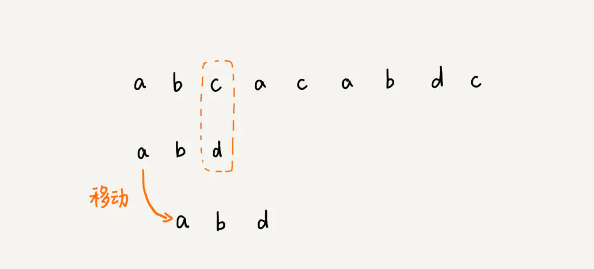

单个字符滑动

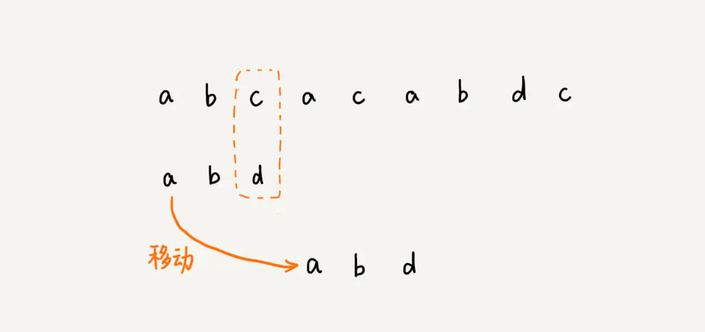

多字符滑动

## BM算法原理分析

之前我们学习的匹配算法都是按照模式串从左向右匹配的，而 BM 算法的匹配顺序是**从右向左**倒着匹配的。

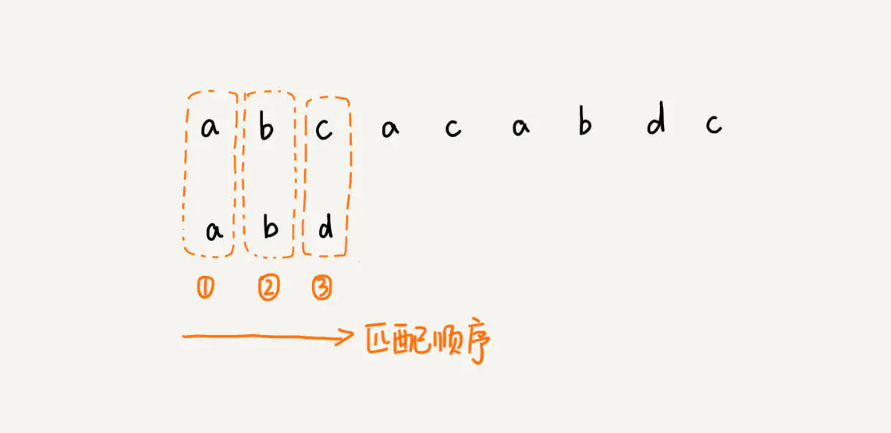

从前向后匹配

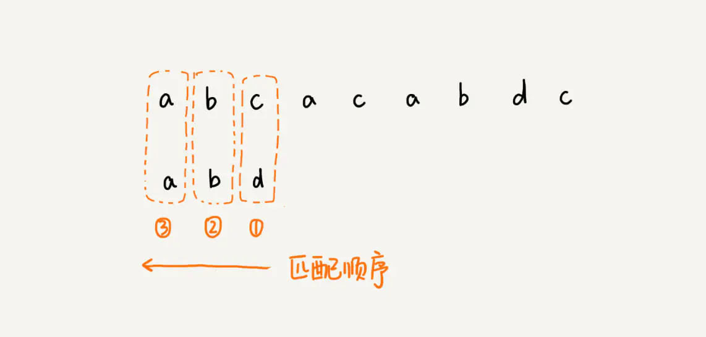

从后向前匹配


BM 算法包含两部分：**坏字符规则 和 好后缀规则**。下面我们依次看一看他们是如何工作的：


### 1.坏字符规则

我们从模式串的末尾向前匹配，当我们发现某个字符串没法匹配的时候。我们把这个无法匹配的字符叫做**坏字符（主串中的字符）**。

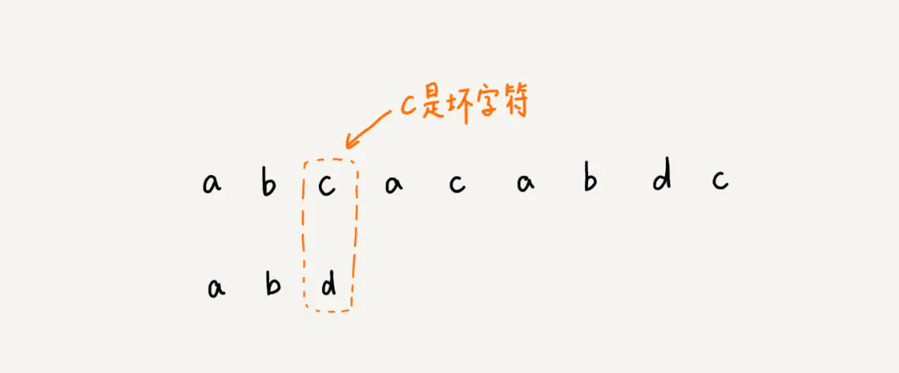

##### 1.1模式串中不含坏字符

如果模式串中不包含坏字符，也就是 c，那就说明这个字符不可能匹配。这个时候，我们可以直接将模式串滑动到 c 后面的位置，开启新的匹配。

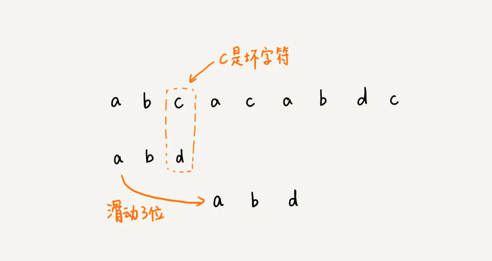

##### 1.2模式串中包含坏字符

如果模式串中包含坏字符，我们可以直接将模式串向后移动到与坏字符对齐的位置，开启新的匹配。

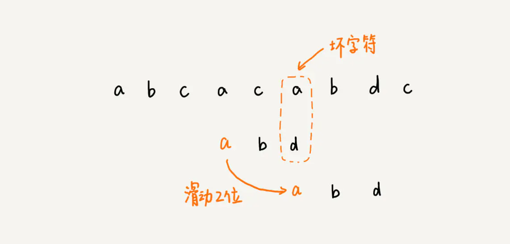

##### 滑动位数的计算

那么，应该滑动多少个字符呢？我们把坏字符对应的模式串的字符下标记作 si ，如果坏字符在模式串中存在，将坏字符在模式串中的下标记作 xi ，如果不存在，就把 xi 记作 -1 。
**模式串滑动的位数就等于 si - xi。**（这里说的下标，都是字符在模式串中的下标）：

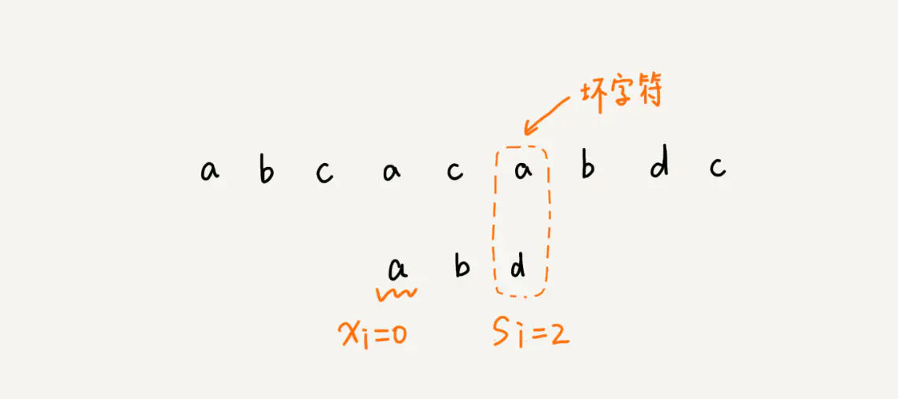

**注意**：如果坏字符在模式串中多处出现，xi 取最大的那个，这样不会让模式串滑动过多，导致略过可能匹配的情况。

### 2.好后缀规则

好后缀规则和坏字符规则有共同之处，看一下下面的图，你就明白什么是好后缀：

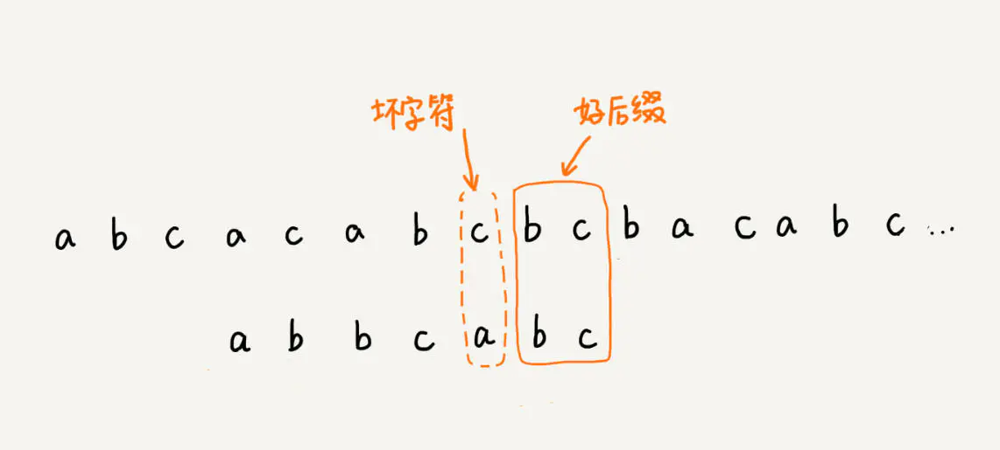

这个时候，你可以利用坏字符规则来计算滑动的位数，也可以利用好后缀处理。当然，如何选择在后面会讲到，抛开这个问题，我们先看看好后缀规则是怎么工作的。

##### 2.1模式串中包含多个好后缀

在上面的图中，bc 是已经匹配成功的字符串，叫做好后缀，我们将其记作 {u}。如果在模式串中找到了与 {u} 匹配的子串 {u*}，我们将模式串滑动到子串{u*} 与 主串中 {u}对齐的位置：

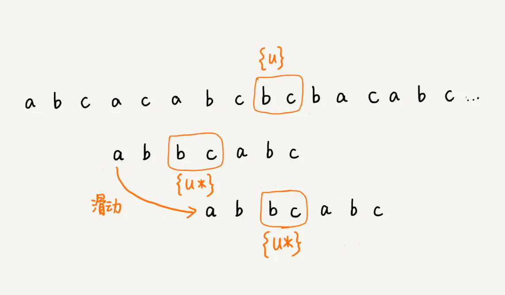

##### 2.2模式串中只包含一个好后缀

如果模式串只有一个为 {u} 的子串，我们就可以直接将模式串滑动到主串中 {u} 的后面：

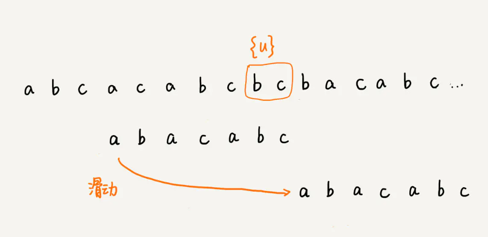

##### 2.3模式串中的后缀子串和前缀子串重合

注意，在 2.2 的滑动在某些情况下是正确的，但是在某些情况下会**过度滑动**：

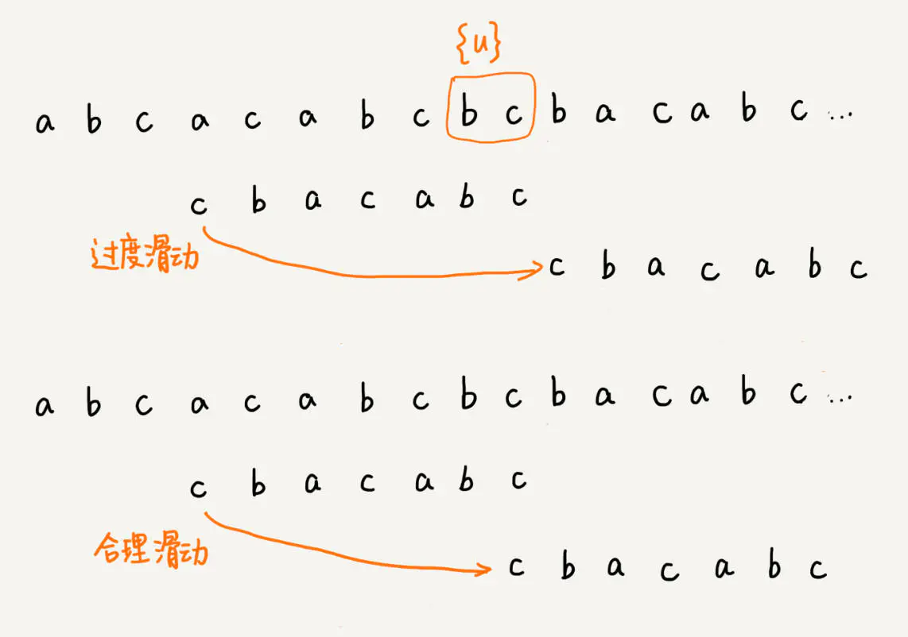

你会发现，如果我们使用 2.2 的滑动方式，可能会错过匹配成功的情况。下面我们需要分析这种情况下应该如何滑动，注意，下面的描述会很难懂，你要多看几遍：


如果主串中的{u}与模式串有重合，使用2.1的方法（对应下图中上面的情况）。当模式串滑动到**前缀与主串中{u}的后缀有部分重合**的时候，就有可能产生完全匹配（对应下图中下面的情况，匹配成功的例子你可以参考上面的那个图）：

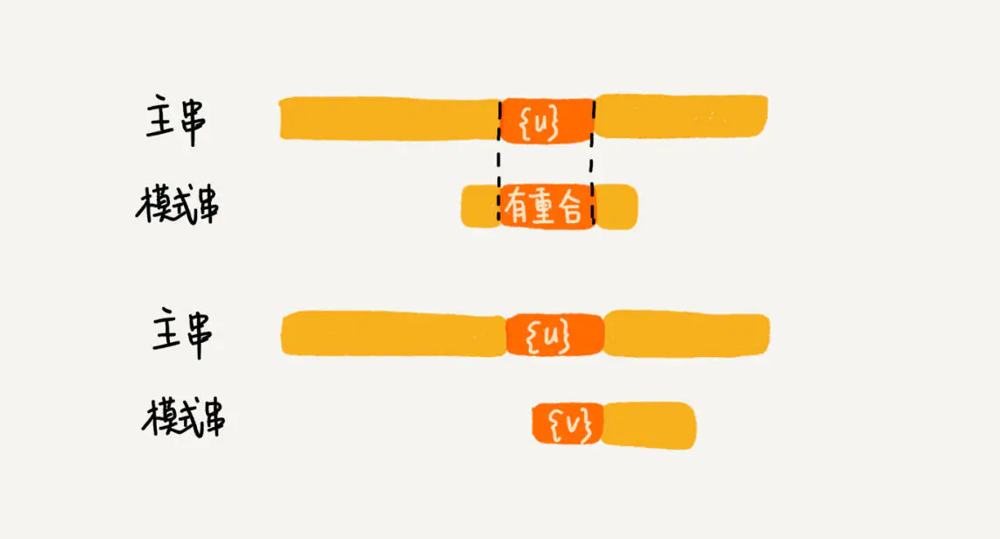

所以，针对这种情况，我们不仅需要看模式串是否有多个好后缀（2.1），还要看好后缀的后缀子串是否和模式串的前缀子串存在匹配，你可以通过下面的图加深理解：

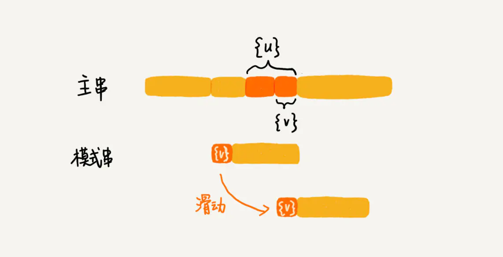

以上就是坏字符和好后缀的基本原理，现在我们考虑之前的那个问题：当模式串和主串某个字符不匹配的时候，如何确定是使用好后缀规则还是坏字符规则？
**我们可以分别计算好后缀和坏字符往后滑动的位数，然后取大的那个作为滑动的位数。**

## BM算法的代码实现

### 1.坏字符的代码实现

之前说过，出现坏字符，我们就要在模式串中寻找与之相同的子串，如果这个查找方式依然使用依次遍历模式串来实现，会比较低效。这里我们可以使用散列表来帮忙存储字符串各个字符的位置信息：


创建一个大小为 256 的数组，默认每个数组值为 -1，利用字符的 ascii 码记录模式串中每个字符出现的位置。（如果出现重复字符，记录的是后面的那个字符的位置）

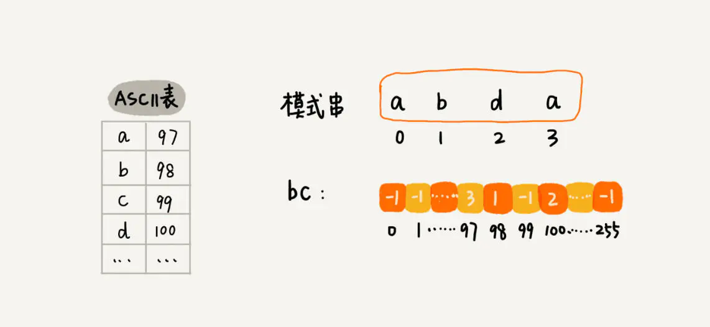


将上面的过程翻译成代码，其中 b 是模式串 ，m 是模式串的长度，bc 表示刚刚讲的散列表：


```java
private static final int SIZE = 256; // 全局变量或成员变量
private void generateBC(char[] b, int m, int[] bc) {
  for (int i = 0; i < SIZE; ++i) {
    bc[i] = -1; // 初始化bc
  }
  for (int i = 0; i < m; ++i) {
    int ascii = (int)b[i]; // 计算b[i]的ASCII值
    bc[ascii] = i;
  }
}
```

构建了散列表，我们先把代码框架写好，这里先不考虑好后缀的规则和移动位数为负的情况：


```cpp
public int bm(char[] a, int n, char[] b, int m) {
  int[] bc = new int[SIZE]; // 记录模式串中每个字符最后出现的位置
  generateBC(b, m, bc); // 构建坏字符哈希表
  int i = 0; // i表示主串与模式串对齐的第一个字符
  while (i <= n - m) {
    int j;
    for (j = m - 1; j >= 0; --j) { // 模式串从后往前匹配
      if (a[i+j] != b[j]) break; // 坏字符对应模式串中的下标是j
    }
    if (j < 0) {
      return i; // 匹配成功，返回主串与模式串第一个匹配的字符的位置
    }
    // 这里等同于将模式串往后滑动j-bc[(int)a[i+j]]位
    i = i + (j - bc[(int)a[i+j]]); 
  }
  return -1;
}
```

针对上面的代码，我们可以使用下面的图加深理解：

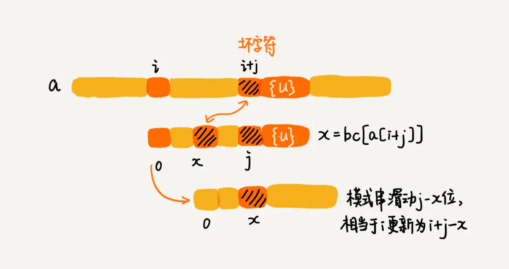

至此，我们完成了坏字符的代码编写，下面编写好后缀的代码。

### 2.好后缀的代码实现

首先我们明确好后缀的核心内容：

1. 在模式串中，查找跟好后缀匹配的另一个子串。
2. 在好后缀的后缀子串中，查找最长的、能和模式串前缀子串陪陪的后缀子串。

为了提高查找效率，我们需要在正式匹配前先预处理模式串，计算好每个后缀子串对应的可匹配的子串位置。

##### 2.1模式串中包含多个好后缀

首先，我们要表示模式串中不同的后缀子串，由于模式串中最后一个字符的位置是固定的 m-1 ，所以我们只需要记录长度就可以了。通过长度，我们可以确定一个唯一的**后缀子串**:

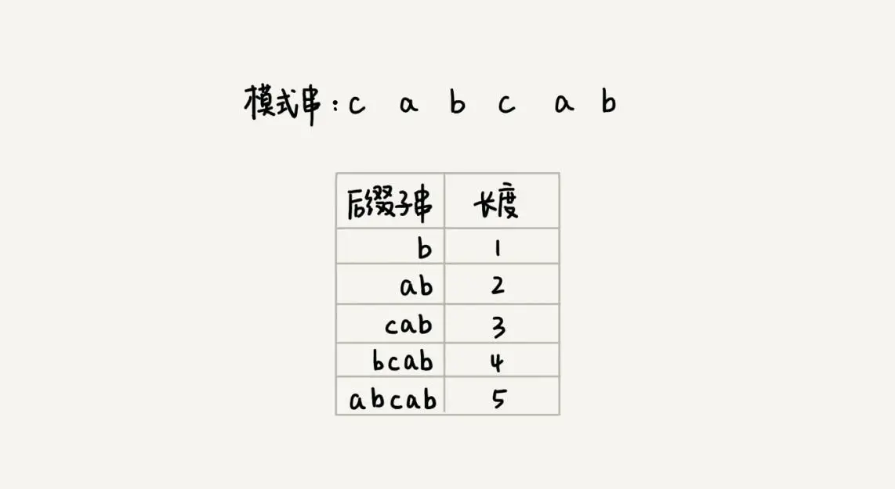

模式串中包含多个好后缀，现在除了后缀子串，我们需要标记和后缀子串相同的各个子串的位置（后缀子串和模式串中的某个子串是重复的，之前我们通过长度已经表示出了各个后缀子串，现在我们就需要用某种方法表示字符串中的那个重复子串（非后缀子串））。
这里我们引入一个 **suffix** 数组，数组值默认为 -1。数组的下标对应后缀子串的长度（表示了后缀子串），数组存储的值是在模式串中与之相匹配的子串。我知道你已经晕了，你可以看一下下面的图：

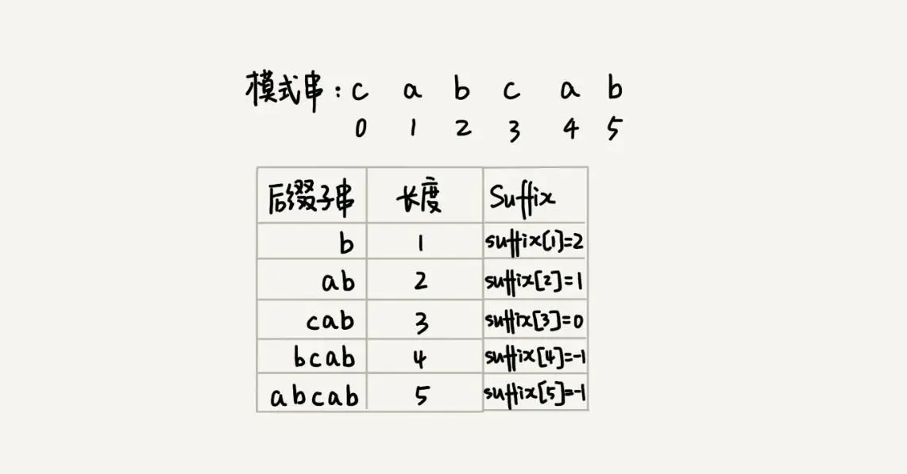

如果模式串中有多个子串与后缀子串相同，那要选则后面的位置。


##### 2.2模式串中后缀子串和前缀子串重合

前面我们已经找出了重复子串的位置，下面我们看如何表示模式串的后最子串与前缀子串重合：


我们需要一个布尔类型的数组 prefix，用来记录模式串的后缀子串能否匹配模式串的前缀子串：

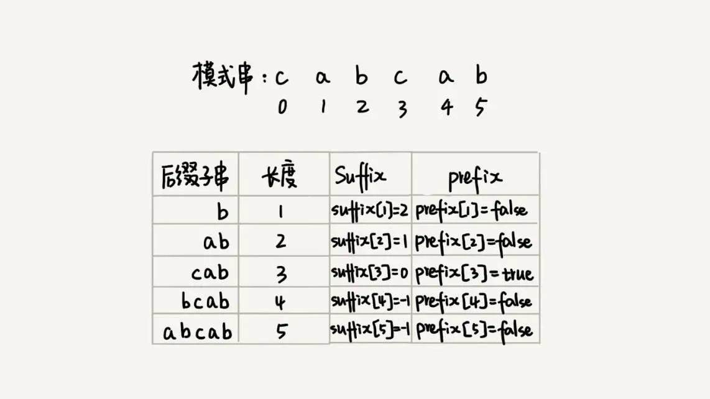

##### 2.3填充 suffix 和 prefix 的值

我们用 k 表示后缀子串的长度，用 j,i 表示重复子串的 起始、终止 下标。其中，i < m-1（保证找到的不是后缀子串本身）。我们记录 suffix[k] = j。


如果这个重复子串也是模式串的前缀子串（j = 0），我们就记录 prefix[x] = true：

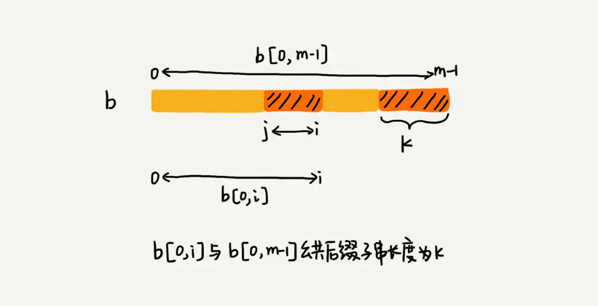

两个数组的计算代码如下：


```java
// b表示模式串，m表示长度，suffix，prefix数组事先申请好了
private void generateGS(char[] b, int m, int[] suffix, boolean[] prefix) {
  for (int i = 0; i < m; ++i) { // 初始化
    suffix[i] = -1;
    prefix[i] = false;
  }
  for (int i = 0; i < m - 1; ++i) { // b[0, i]
    int j = i;
    int k = 0; // 公共后缀子串长度
    while (j >= 0 && b[j] == b[m-1-k]) { // 与b[0, m-1]求公共后缀子串
      --j;
      ++k;
      suffix[k] = j+1; //j+1表示公共后缀子串在b[0, i]中的起始下标
    }
    if (j == -1) prefix[k] = true; //如果公共后缀子串也是模式串的前缀子串
  }
}
```

##### 2.4计算滑动位数

有了这两个数组，我们可以很容易地计算在模式串和主串匹配中需要滑动的位数：

- 有重复子串的情况：

  假设好后缀的长度是 k 。我们在 suffix 中查找与其匹配的子串，如果 suffix[k] 不为 -1 ，则移动位数为 j - suffix[k] + 1，其中 j 是坏字符在模式串中的下标：

  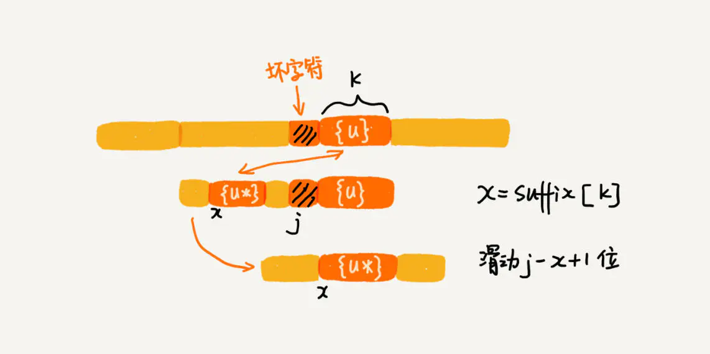

- 后缀子串和前缀子串重合的情况：

  好后缀的后缀子串 b[ r , m - 1]，的长度为 k = m - r，如果prefix[k] == true ，表示长度为 k 的后缀子串 有 可以匹配的前缀子串，这样我们可以把模式串后移 r 位。

  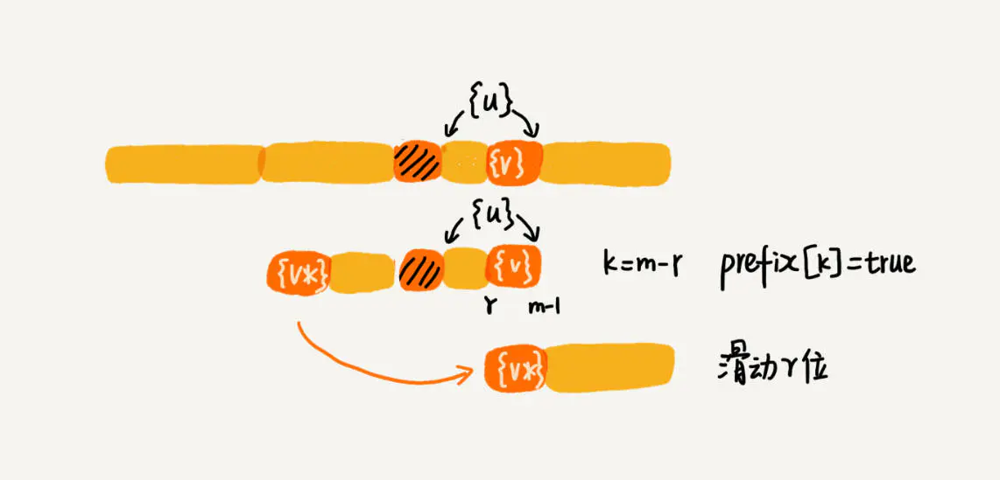

- 前两条规则的子串都不存在：我们直接向模式串后移 m 位：

  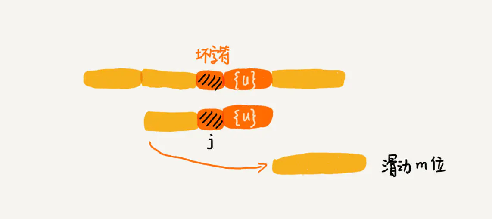

### 代码

下面是完整的 BM 算法的代码：


```java
// a,b表示主串和模式串；n，m表示主串和模式串的长度。
public int bm(char[] a, int n, char[] b, int m) {
  int[] bc = new int[SIZE]; // 记录模式串中每个字符最后出现的位置
  generateBC(b, m, bc); // 构建坏字符哈希表
  int[] suffix = new int[m];
  boolean[] prefix = new boolean[m];
  generateGS(b, m, suffix, prefix);
  int i = 0; // j表示主串与模式串匹配的第一个字符
  while (i <= n - m) {
    int j;
    for (j = m - 1; j >= 0; --j) { // 模式串从后往前匹配
      if (a[i+j] != b[j]) break; // 坏字符对应模式串中的下标是j
    }
    if (j < 0) {
      return i; // 匹配成功，返回主串与模式串第一个匹配的字符的位置
    }
    int x = j - bc[(int)a[i+j]];
    int y = 0;
    if (j < m-1) { // 如果有好后缀的话
      y = moveByGS(j, m, suffix, prefix);
    }
    i = i + Math.max(x, y);
  }
  return -1;
}

// j表示坏字符对应的模式串中的字符下标; m表示模式串长度
private int moveByGS(int j, int m, int[] suffix, boolean[] prefix) {
  int k = m - 1 - j; // 好后缀长度
  if (suffix[k] != -1) return j - suffix[k] +1;
  for (int r = j+2; r <= m-1; ++r) {
    if (prefix[m-r] == true) {
      return r;
    }
  }
  return m;
}
```

## 性能分析

- 空间复杂度：需要消耗 bc 数组、suffix 数组 和 prefix 数组。第一个数组和字符集大小有关，后两个数组的大小和模式串长度 m 有关。
  如果我们处理字符集很大的匹配问题，bc 数组会消耗很多，如果内存紧张，你可以考虑不是用坏字符规则，以避免过多的内存消耗。
- 时间复杂度：非常复杂，你只需要知道这个算法已经算是非常高效的算法即可。
