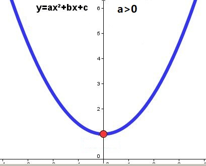

#### 360. 有序转化数组

给你一个已经 排好序 的整数数组 nums 和整数 a、b、c。对于数组中的每一个数 x，计算函数值 f(x) = ax2 + bx + c，请将函数值产生的数组返回。

要注意，返回的这个数组必须按照 **升序排列**，并且我们所期望的解法时间复杂度为 **O(\*n\*)**。

**示例 1：**

```shell
输入: nums = [-4,-2,2,4], a = 1, b = 3, c = 5
输出: [3,9,15,33]
```

**示例 2：**

```shell
输入: nums = [-4,-2,2,4], a = -1, b = 3, c = 5
输出: [-23,-5,1,7]
```

### 题解

# 一元二次函数分析

初中数学知识告诉我们，遇到公式 f(x) = ax^2 + bx + c，首先要做的是分类讨论。

* a = 0 时，f(x) 是一次函数

  * b>0，f(x) 是单调递增的一元一次函数
  * b<0，f(x) 是单调递减的一元一次函数
  * b=0，f(x) = c

* a > 0 时，f(x) 是开口向上的一元二次函数

  * 此时边界值最大，中心轴上的值最小

  

 

* a < 0 时，f(x) 是开口向下的一元二次函数
  * 此时边界值最小，中心轴上的值最大

再次回到问题，根据 a 和 b 的取值不同，本题可以进行分类讨论。假设 nums 为原数组，result 为保存结果的数组。题干中要求算法时间复杂度为 O(n)。

* a=0 时，显然可以一次遍历完成，算法时间复杂度为 O(n)。
  * 需要注意的是，当 b < 0 时，nums[i] 的计算结果应该保存到 result[nums.length-1-i] 中。

* a != 0 时，采用双指针的解法。
  * 首先求出中心轴的位置 middle = -b / (2 * a)。
  * 然后将 两个指针 left 和 right 分别指向 nums 的最左端和最右端，通过判断两个指针与中心轴距离的大小，决定哪个指针指向的值参与计算。
  * 由于时间复杂度的限制，在循环的过程中，根据 a 的正负性，我们需要将计算结果直接保存到 result 的左侧或右侧。


```java
//leetcode submit region begin(Prohibit modification and deletion)
class Solution {
    public int[] sortTransformedArray(int[] nums, int a, int b, int c) {
        int length = nums.length;
        if (length == 0) {
            return new int[0];
        }

        int[] result = new int[length];
        if (a == 0) {
            if (b > 0) {
                for (int i = 0; i < length; i++) {
                    result[i] = b * nums[i] + c;
                }
            } else {
                for (int i = 0; i < length; i++) {
                    result[i] = b * nums[length - 1 - i] + c;
                }
            }
            return result;
        }

        double middle = -b * 1.0 / (2 * a);
        int left = 0;
        int right = length - 1;
        int i = a < 0 ? 0 : length - 1;

        while (left <= right) {
            double leftDistance = Math.abs(middle - nums[left]);
            double rightDistance = Math.abs(nums[right] - middle);

            if (leftDistance >= rightDistance) {
                result[i] = a * nums[left] * nums[left] + b * nums[left] + c;
                i = a < 0 ? i + 1 : i - 1;
                left++;
            } else {
                result[i] = a * nums[right] * nums[right] + b * nums[right] + c;
                i = a < 0 ? i + 1 : i - 1;
                right--;
            }
        }
        return result;
    }
}
//leetcode submit region end(Prohibit modification and deletion)

```

