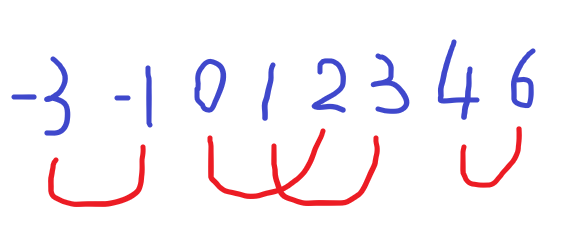

#### 1982. 从子集的和还原数组

存在一个未知数组需要你进行还原，给你一个整数 n 表示该数组的长度。另给你一个数组 sums ，由未知数组中全部 2n 个 子集的和 组成（子集中的元素没有特定的顺序）。

返回一个长度为 `n` 的数组 `ans` 表示还原得到的未知数组。如果存在 **多种** 答案，只需返回其中 **任意一个** 。

如果可以由数组 arr 删除部分元素（也可能不删除或全删除）得到数组 sub ，那么数组 sub 就是数组 arr 的一个 子集 。sub 的元素之和就是 arr 的一个 子集的和 。一个空数组的元素之和为 0 。

**注意：**生成的测试用例将保证至少存在一个正确答案。

**示例 1：**

```shell
输入：n = 3, sums = [-3,-2,-1,0,0,1,2,3]
输出：[1,2,-3]
解释：[1,2,-3] 能够满足给出的子集的和：
- []：和是 0
- [1]：和是 1
- [2]：和是 2
- [1,2]：和是 3
- [-3]：和是 -3
- [1,-3]：和是 -2
- [2,-3]：和是 -1
- [1,2,-3]：和是 0
注意，[1,2,-3] 的任何排列和 [-1,-2,3] 的任何排列都会被视作正确答案。
```

**示例 2：**

```shell
输入：n = 2, sums = [0,0,0,0]
输出：[0,0]
解释：唯一的正确答案是 [0,0] 。
```

**示例 3：**

```shell
输入：n = 4, sums = [0,0,5,5,4,-1,4,9,9,-1,4,3,4,8,3,8]
输出：[0,-1,4,5]
解释：[0,-1,4,5] 能够满足给出的子集的和。
```

**提示：**

- `1 <= n <= 15`
- `sums.length == 2n`
- `-104 <= sums[i] <= 104`

### 题解

# 哪些是能确定的值？

本题的难点在于我们很难确定sums中每个数是由原数组的哪些元素组合而出的。因此我的第一想法是，在sums中有哪些是容易求出的，且容易知道它的组成部分的值呢？

首先能想到的是原数组所有数的和，它是sums平均值的两倍，但这似乎并没有什么用。随之能够想到的确定的部分是:sums的最大值一定是原数组所有正数之和，sums的最小值一定是原数组所有负数之和。这两个值似乎也没有什么用。但是，既然我知道所有正数的和，如果我将它里面累加的元素去掉一个，似乎就可以确定一个元素了？

# 确定原数组中绝对值最小的元素

我们思考一下sums里次大的值是怎么来的。很明显，次大值的组成元素里应该只和原数组的所有正数相差了一个元素。要么我不累加最小的正数或0，要么是我再加上一个最大的、最接近0的负数。

因此，sums的最大值和次大值的差d一定是原数组里某一个数的绝对值，并且它是原数组未确定的元素中绝对值最小的一个。虽然我们不知道它的正负，但是我们每轮循环都能确定一个元素，只产生正负两种可能的情况。此时，我们完全能够承担搜索的复杂度，因此把确定符号的工作完全交给DFS即可。接下来唯一的任务，就是怎么根据这个绝对值，将sums分成没有累加过d的集合S和累加过d的集合T。

# 将sums划分为包含d和不包含d的两半

我们不妨先假定d是正的（之后再看d是负的的情况）。来看这么一个例子：

假定剩余元素拼凑出的部分S是[-3 , 0 , 1 , 4]，我们筛出来的d是2，那么将d和剩余部分合并之后的集合T是[-1 , 2 , 3 , 6]，整个sums就应该是[-3 , -1 , 0 , 1 , 2 , 3 , 4 , 6]。

显然S和T可以构建一个双射关系：[-3 , -1] , [0 , 2] , [1 , 3] , [4 , 6]。我们在整个sums中观察一下这四对的关系：



可以看到，属于S的部分一定是每一对的左侧，而属于TT的一定在右侧。而我们在从左往右扫描sums的过程中，要么遇到一个新的未匹配的属于S的部分，要么遇到一个等待匹配的属于T的部分。由于sums是排过序的，故而待确定的元素也是有序的。因此我们可以这样做：

1. 用一个队列Q来保存待确定的属于T的部分，从左往右扫描sums。
2. 若当前元素k与待确定队列Q的队首不相同，则k属于S。将kk加入S，k+d加入T，并将k+d加入队列Q，以便我们知道k+d是已处理元素。
3. 若当前元素k和Q的队首相同，则k为等待匹配的属于T的元素。由于我们已经将它加入了集合T，将其从队列Q弹出即可。

这样，我们就将原序列sums分成了包含d的集合S和不包含d的集合S。在S中继续重复这一步骤，直到我们划分出了完整的n个数。

那么，如果d是负数又会是什么情形呢？显然，在其余组成元素都相同的时候，加上d会比不加上d要小。也就是说此时属于S的是每一对的右侧，属于T的是每一对的左侧。我们仍然按照d是正数的情况进行划分，只需要在后续递归的部分改为在T中进行搜索即可。

# 时间复杂度？

在每一次递归中，我们均需要对整个sums进行一次线性扫描。同时，每次递归最多产生2个分支，但每个分支也会使待搜索的空间sums减半。即，每次递归会使状态数翻倍，但扫描工作量减半，两相抵消。

因此，对于递归的每一层，我们都最多扫描O(2^n)个元素，而递归的深度至多为n，故搜索的时间复杂度为*O*(*n*2*n*)。空间复杂度与之相同。

除此之外，我们要预先对sums进行排序，这部分的时间复杂度同样为O(2^nlog(2^n)) = O(n2^n)

```java
class Solution {
 public int[] recoverArray(int n, int[] sums) {
        List<Integer> list = new ArrayList<>();
        for (int sum : sums) {
            list.add(sum);
        }

        List<Integer> ressult = new ArrayList<>();
        Collections.sort(list);
        dfs(n, list, ressult);
        int[] ans = new int[ressult.size()];

        int index = 0;
        for (int res : ressult) {
            ans[index++] = res;
        }
        return ans;
    }

    public boolean dfs(int n, List<Integer> sums, List<Integer> ans) {
        // 若n为0，原数组的每个数均已确定，返回
        if (n == 0) {
            return true;
        }

        // 计算待确定元素中，绝对值最小的元素。
        // 也可以根据sums[1] - sums[0]计算
        int d = sums.get((1 << n) - 1) - sums.get((1 << n) - 2);
        // 2bit标志位，表示d是否存在为正或为负的可能
        int mask = 0;
        // 单个元素本身必定存在于sums，因此扫描整个sums，检查是否有d或-d存在
        for (int sum : sums) {
            if (sum == d) {
                mask |= 1;
            } else if (sum == -d) {
                mask |= 2;
            }
        }

        // 若mask为0，说明d和-d均不在sums中，之前的划分有误，需要回溯
        if (mask == 0) {
            return false;
        }
        List<Integer> S = new ArrayList<>();
        List<Integer> T = new ArrayList<>();
        Queue<Integer> queue = new LinkedList();

        for (int sum : sums) {
            // 步骤3的情况，当前元素k已被处理过，弹出Q的队首
            if (!queue.isEmpty() && queue.peek() == sum) {
                queue.poll();
                continue;
            }

            // 步骤2的情况，将k和k+d分别加入S和T，将k+d置入待确定队列Q
            S.add(sum);
            T.add(sum + d);
            queue.add(sum + d);
        }

        // 若最低标志位为1，说明sums中存在d，存在+d为原数组元素之一的可能。此时不包含+d的集合为S。
        if ((mask & 1) == 1) {
            ans.add(d);
            if (dfs(n - 1, S, ans)) {
                return true;
            } else {
                ans.remove(ans.size() - 1);
            }
        } 
         if (mask >> 1 == 1) {
            ans.add(-d);
            if (dfs(n - 1, T, ans)) {
                return true;
            } else {
                ans.remove(ans.size() - 1);
            }
        }
        return false;
    }
}
```

