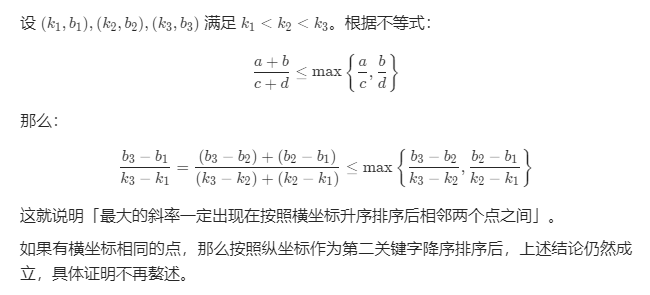
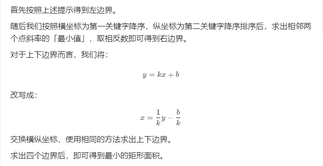
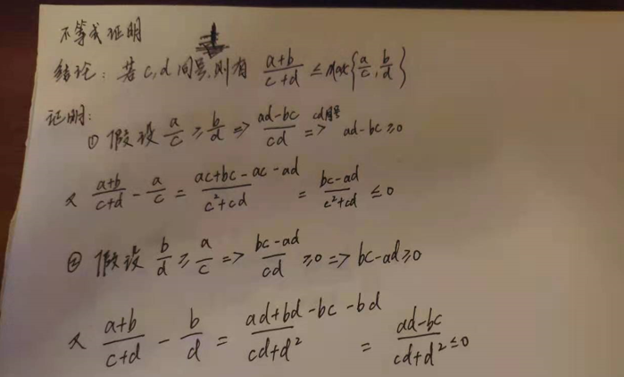
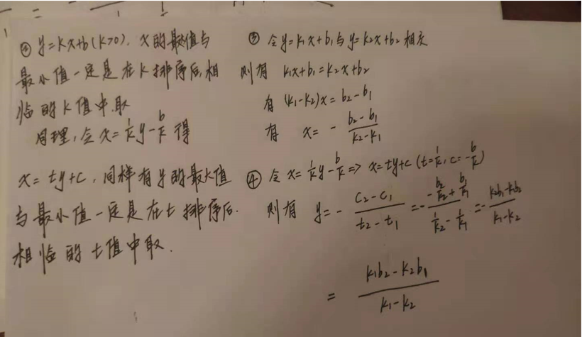
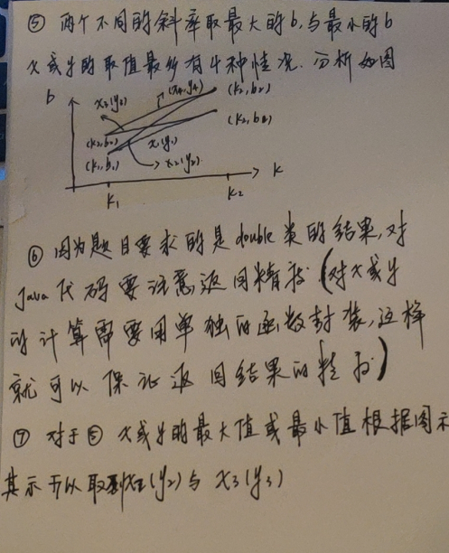

#### LCP 37. 最小矩形面积

二维平面上有*N*条直线，形式为y = kx + b，其中k、`b`为整数且k > 0。所有直线以[k,b]的形式存于二维数组lines中，不存在重合的两条直线。两两直线之间可能存在一个交点，最多会有个交点。我们用一个平行于坐标轴的矩形覆盖所有的交点，请问这个矩形最小面积是多少。若直线之间无交点、仅有一个交点或所有交点均在同一条平行坐标轴的直线上，则返回0。

注意：返回结果是浮点数，与标准答案 **绝对误差或相对误差** 在 10^-4 以内的结果都被视为正确结果

**示例 1：**

> 输入：lines = [[2,3],[3,0],[4,1]]
>
> 输出：48.00000
>
> 解释：三条直线的三个交点为 (3, 9) (1, 5) 和 (-1, -3)。最小覆盖矩形左下角为 (-1, -3) 右上角为 (3,9)，面积为 48
>

**示例 2：**

> 输入：`lines = [[1,1],[2,3]]`
>
> 输出：`0.00000`
>
> 解释：仅有一个交点 (-2，-1）

**限制：**

* 1 <= lines.length <= 10^5 且 lines[i].length == 2
  1 <= lines[0] <= 10000
  -10000 <= lines[1] <= 10000
  与标准答案绝对误差或相对误差在 10^-4 以内的结果都被视为正确结果

### 题解

#### 前言

由于本题是「力扣杯」的竞赛题，因此只会给出提示、简要思路以及代码，不会对算法本身进行详细说明，希望读者多多思考。

#### 提示 1


#### 提示 2



#### 思路



#### 补充







**代码**

```java
class Solution {

     public double minRecSize(int[][] lines) {
        int n = lines.length;
        if (n <= 2) {
            return 0;
        }
        Arrays.sort(lines, (a, b) -> a[0] == b[0] ? b[1] - a[1] : a[0] - b[0]);

        double minX = Double.MAX_VALUE;
        double maxX = Double.MIN_VALUE;
        double minY = Double.MAX_VALUE;
        double maxY = Double.MIN_VALUE;

        int left = 0;
        int right = left;

        while (right < n && lines[right][0] == lines[left][0]) {
            right++;
        }
        if (right >= n) {
            return 0;
        }

        while (right < n) {
            int tempRight = right;
            while (tempRight + 1 < n && lines[tempRight + 1][0] == lines[right][0]) {
                tempRight++;
            }
            double x1 = getX(lines, left, tempRight);
            double x2 = getX(lines, right - 1, right);
            double y1 = getY(lines, left, tempRight);
            double y2 = getY(lines, right - 1, right);
            minX = Math.min(minX, Math.min(x1, x2));
            maxX = Math.max(maxX, Math.max(x1, x2));
            minY = Math.min(minY, Math.min(y1, y2));
            maxY = Math.max(maxY, Math.max(y1, y2));
            left = right;
            right = tempRight + 1;
           while (right < n && lines[right][0] == lines[left][0]) {
               right++;
           }
        }

        return (maxX - minX) * (maxY - minY);
    }

    private double getX(int[][] lines, int p, int q) {
        return 1.0 * (lines[p][1] - lines[q][1]) / (lines[q][0] - lines[p][0]);
    }

    private double getY(int[][] lines, int p, int q) {
        return 1.0 * (lines[q][1] * lines[p][0] - lines[p][1] * lines[q][0]) / (lines[q][0] - lines[p][0]);
    }
}
```

