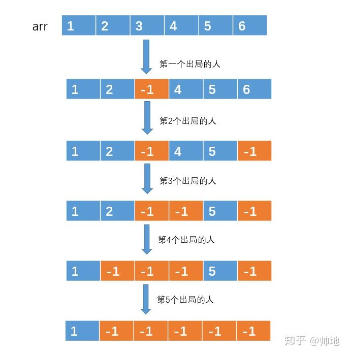
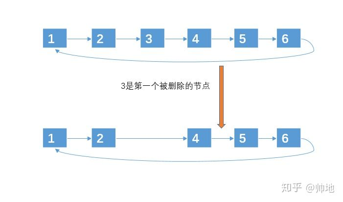

## 一道阿里笔试题：我是如何用一行代码解决约瑟夫环问题的

问题描述：编号为 1-N 的 N 个士兵围坐在一起形成一个圆圈，从编号为 1 的士兵开始依次报数（1，2，3...这样依次报），数到 m 的 士兵会被杀死出列，之后的士兵再从 1 开始报数。直到最后剩下一士兵，求这个士兵的编号。

### 1、方法一：数组
思维：
用一个数组来存放 1，2，3 ... n 这 n 个编号，如图（这里我们假设n = 6, m = 3）


然后不停着遍历数组，对于被选中的编号，我们就做一个标记，例如编号 arr[2] = 3 被选中了，那么我们可以做一个标记，例如让 arr[2] = -1，来表示 arr[2] 存放的编号已经出局的了。


然后就按照这种方法，不停着遍历数组，不停着做标记，直到数组中只有一个元素是非 -1 的，这样，剩下的那个元素就是我们要找的元素了。我演示一下吧：



这种方法简单吗？思路简单，但是编码却没那么简单，临界条件特别多，每次遍历到数组最后一个元素的时候，还得重新设置下标为 0，并且遍历的时候还得判断该元素时候是否是 -1。感兴趣的可以动手写一下代码，用这种数组的方式做，千万不要觉得很简单，编码这个过程还是挺考验人的。

这种做法的时间复杂度是 O(n * m), 空间复杂度是 O(n);

代码如下：

```java
private static int Josephus(int n, int m) {
	    int[] peopleArr = new int[n];
	    for (int i = 0; i < n; i++) {
	        peopleArr[i] = i + 1;
	    }
	    int index = 0;
	    int length = n;
	    int count = 1;
	
	    while (length > 0) {
            // 这里的(index%n)保证士兵序列号一直在0~n-1之前循环
            // 当循环到某个士兵的值大于0时，说明该士兵当前还没有被啥
	        if (peopleArr[index % n] > 0) {
                // index不管是否数到m，也不管该士兵是否被杀，它会一直计数
                // count只是在没有被杀的士兵中计数
                // length在数到m后，值减1
                // peopleArr数组的值在数到m后，将该士兵的值置为-1
                if (count % m == 0) {
	                System.out.print(peopleArr[index % n] + "  ");
	                peopleArr[index % n] = -1;
	                count = 1;
	                index++;
	                length--;
	            } else {
	                index++;
	                count++;
	            }
	        } else { 
                // 此处说明该士兵已被杀
	            // 遇到空位了，就跳到下一位，但count不加1，也就是这个位置没有报数
	            index++;
	        }
	    }
	    return index%n;
	}
```

### 2、方法二：环形链表

学过链表的人，估计都会用链表来处理约瑟夫环问题，用链表来处理其实和上面处理的思路差不多，只是用链表来处理的时候，对于被选中的编号，不再是**做标记**，而是**直接移除**，因为从链表移除一个元素的时间复杂度很低，为 O(1)。当然，上面数组的方法你也可以采用移除的方式，不过数组移除的时间复杂度为 O(n)。所以采用链表的解决方法如下：

1、先创建一个环形链表来存放元素：


2、然后一边遍历链表一遍删除，直到链表只剩下一个节点，我这里就不全部演示了



代码如下：

```java
// 定义链表节点
class Node{
    int data;
    Node next;

    public Node(int data) {
        this.data = data;
    }
}
```

核心代码：

```java
public static int solve(int n, int m) {
        if(m == 1 || n < 2)
            return n;
        // 创建环形链表
        Node head = createLinkedList(n);
        // 遍历删除
        int count = 1;
        Node cur = head;
        Node pre = null;//前驱节点
        while (head.next != head) {
            // 删除节点
            if (count == m) {
                count = 1;
                pre.next = cur.next;
                cur = pre.next;
            } else {
                count++;
                pre = cur;
                cur = cur.next;
            }
        }
        return head.data;
    }

    static Node createLinkedList(int n) {
        Node head = new Node(1);
        Node next = head;
        for (int i = 2; i <= n; i++) {
            Node tmp = new Node(i);
            next.next = tmp;
            next = next.next;
        }
        // 头尾串联
        next.next = head;
        return head;
    }
```

### 方法三：递归

其实这道题还可以用递归来解决，递归是思路是**每次我们删除了某一个士兵之后，我们就对这些士兵重新编号，然后我们的难点就是找出删除前和删除后士兵编号的映射关系**。

我们定义递归函数 f(n，m) 的返回结果是存活士兵的编号，显然当 n = 1 时，f(n, m) = 1。假如我们能够找出 f(n，m) 和 f(n-1，m) 之间的关系的话，我们就可以用递归的方式来解决了。我们假设人员数为 n, 报数到 m 的人就自杀。则刚开始的编号为

… 1 ... m - 2

m - 1

m

m + 1

m + 2 ... n …

进行了一次删除之后，删除了编号为 m 的节点。删除之后，就只剩下 n - 1 个节点了，删除前和删除之后的编号转换关系为：

删除前 --- 删除后

… --- …

m - 2 --- n - 2

m - 1 --- n - 1

m ---- 无(因为编号被删除了)

m + 1 --- 1(因为下次就从这里报数了)

m + 2 ---- 2

… ---- …

新的环中只有 n - 1 个节点。且删除前编号为 m + 1, m + 2, m + 3 的节点成了删除后编号为 1， 2， 3 的节点。

假设 old 为删除之前的节点编号， new 为删除了一个节点之后的编号，则 old 与 new 之间的关系为 old = (new + m - 1) % n + 1。

```tex
注：有些人可能会疑惑为什么不是 old = (new + m ) % n 呢？主要是因为编号是从 1 开始的，而不是从 0 开始的。如果 new + m == n的话，会导致最后的计算结果为 old = 0。所以 old = (new + m - 1) % n + 1. 这样，我们就得出 f(n, m) 与 f(n - 1, m)之间的关系了，而 f(1, m) = 1.所以我们可以采用递归的方式来做。
```

代码如下：

```java
int f(int n, int m){
    if(n == 1)   return n;
    return (f(n - 1, m) + m - 1) % n + 1;
}

int f(int n, int m){
    return n == 1 ? n : (f(n - 1, m) + m - 1) % n + 1;
}
```

```java
class Solution {
    public int lastRemaining(int n, int m) {
        return f(n, m);
    }

    public int f(int n, int m) {
        if (n == 1) {
            return 0;
        }
        return (f(n - 1, m) + m) % n;
    }
}
```

