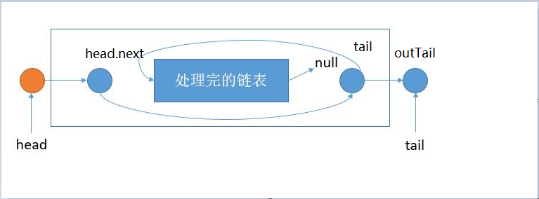

# 重排链表

# 题目描述（中等难度）

给定一个单链表 L：L0→L1→…→Ln-1→Ln ，
将其重新排列后变为： L0→Ln→L1→Ln-1→L2→Ln-2→…

你不能只是单纯的改变节点内部的值，而是需要实际的进行节点交换。

示例 1:

给定链表 1->2->3->4, 重新排列为 1->4->2->3.
示例 2:

给定链表 1->2->3->4->5, 重新排列为 1->5->2->4->3.

# 解法一 存储

链表的缺点就是不能随机存储，当我们想取末尾元素的时候，只能从头遍历一遍，很耗费时间。第二次取末尾元素的时候，又得遍历一遍。

所以先来个简单粗暴的想法，把链表存储到线性表中，然后用双指针依次从头尾取元素即可。

**完整代码：**

```java
/**
 * Definition for singly-linked list.
 * public class ListNode {
 *     int val;
 *     ListNode next;
 *     ListNode() {}
 *     ListNode(int val) { this.val = val; }
 *     ListNode(int val, ListNode next) { this.val = val; this.next = next; }
 * }
 */
class Solution {
    public void reorderList(ListNode head) {
        if (head==null||head.next==null||head.next.next==null){
            return;
        }
        ListNode cur = head;
        ArrayList<ListNode> list = new ArrayList();
        while(cur!=null){
            list.add(cur);
            cur=cur.next;
        }  
        int i=0;
        int j=list.size()-1;
        while(i<j){
            list.get(i).next=list.get(j);
            i++;
            if (i==j){
                break;
            }
            list.get(j).next=list.get(i);
            j--;
        }
        list.get(j).next=null;
    }
}
```

# 解法二 递归

解法一中也说到了，我们的问题就是取尾元素的时候，需要遍历一遍链表。

如果我们的递归函数能够返回当前头元素对应的尾元素，并且将头元素和尾元素之间的链表按要求完成，那就变得简单了。



递归出口的话，如果只有一个节点，那么我们只需要将 `head.next` 返回。

```java
if (len == 1) {
    ListNode outTail = head.next;
    head.next = null;
    return outTail;
}
```

如果是两个节点，我们需要将 `head.next.next` 返回。

```java
if (len == 2) {
    ListNode outTail = head.next.next;
    head.next.next = null;
    return outTail;
}
```

**完整代码：**

```shell
/**
 * Definition for singly-linked list.
 * public class ListNode {
 *     int val;
 *     ListNode next;
 *     ListNode() {}
 *     ListNode(int val) { this.val = val; }
 *     ListNode(int val, ListNode next) { this.val = val; this.next = next; }
 * }
 */
class Solution {
    public void reorderList(ListNode head) {
        if (head==null||head.next==null||head.next.next==null){
            return;
        }
        int len=0;
        ListNode cur=head;
        while(cur!=null){
            len++;
            cur=cur.next;
        }
        reorderListHelper(head,len);   
    }

    public ListNode reorderListHelper(ListNode head,int len){
        if (len==1){
            // 计算该层链表的外部尾巴
            ListNode outTail=head.next;
            // 处理该层链表
            head.next=null;
            return outTail;
        }

        if (len==2){
            // 计算该层链表的外部尾巴
            ListNode outTail=head.next.next;
            // 处理该层链表
            head.next.next=null;
            return outTail;
        }
        
        // 通过reorderListHelper得知该层链表的尾巴
        ListNode tail=reorderListHelper(head.next,len-2);
        // 计算该层链表外部一层链表的尾巴，处理完该层链表后，返回给外部一层链表处理
        ListNode outTail=tail.next;
        // 处理该层链表
        ListNode subHead=head.next;
        head.next=tail;
        tail.next=subHead;
        return outTail;
    } 
}
```

# 解法三

主要是利用到一头一尾取元素的特性。

主要是三步，举个例子。

```java
1 -> 2 -> 3 -> 4 -> 5 -> 6
第一步，将链表平均分成两半
1 -> 2 -> 3
4 -> 5 -> 6
    
第二步，将第二个链表逆序
1 -> 2 -> 3
6 -> 5 -> 4
    
第三步，依次连接两个链表
1 -> 6 -> 2 -> 5 -> 3 -> 4
```

第一步找中点的话，可以应用快慢指针。快指针一次走两步，慢指针一次走一步，当快指针走到终点的话，慢指针会刚好到中点。如果节点个数是偶数的话，slow 走到的是左端点，利用这一点，我们可以把奇数和偶数的情况合并，不需要分开考虑。

第二步链表逆序的话，有迭代和递归的两种方式，迭代的话主要利用两个指针，依次逆转。

第三步的话就很简单了，两个指针分别向后移动就可以。

**完整代码：**

```java
/**
 * Definition for singly-linked list.
 * public class ListNode {
 *     int val;
 *     ListNode next;
 *     ListNode() {}
 *     ListNode(int val) { this.val = val; }
 *     ListNode(int val, ListNode next) { this.val = val; this.next = next; }
 * }
 */
class Solution {
    public void reorderList(ListNode head) {
        if (head==null||head.next==null||head.next.next==null){
            return;
        }
        ListNode slow=head;
        ListNode fast=head;
        while(fast!=null&&fast.next!=null){
            slow=slow.next;
            fast=fast.next.next;
        }
        ListNode newHead=slow.next;
        slow.next=null;
        newHead=reverseList(newHead);

        ListNode curHead=head;
        ListNode curNewHead=newHead;
        while(curHead!=null&&curNewHead!=null){
           ListNode nextHead=curHead.next;
           ListNode nextNewHead=curNewHead.next;
           curHead.next=curNewHead;
           curNewHead.next=nextHead;
           curHead=nextHead;
           curNewHead=nextNewHead;
        }
    }

    public ListNode reverseList(ListNode head) {
        if (head==null||head.next == null){
            return head;
        } 
        ListNode preNode=null;
        ListNode curNode=head;
        ListNode nextNode=null;
        while(curNode!=null){
            nextNode=curNode.next;
            curNode.next=preNode;
            preNode=curNode;
            curNode=nextNode;
        }
        return preNode;
    }
}
```

