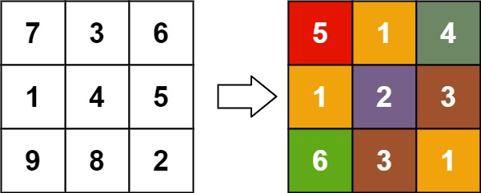

#### 1632. 矩阵转换后的秩

给你一个` m x n` 的矩阵` matrix` ，请你返回一个新的矩阵 `answer` ，其中 `answer[row][col] `是 `matrix[row][col] `的秩。

每个元素的 **秩** 是一个整数，表示这个元素相对于其他元素的大小关系，它按照如下规则计算：

* 秩是从 1 开始的一个整数。
* 如果两个元素 p 和 q 在 同一行 或者 同一列 ，那么：
  * 如果 p < q ，那么 rank(p) < rank(q)
  * 如果 p == q ，那么 rank(p) == rank(q)
  * 如果 p > q ，那么 rank(p) > rank(q)
* 秩 需要越 小 越好。

题目保证按照上面规则 `answer` 数组是唯一的。

**示例 1：**


```shell
输入：matrix = [[1,2],[3,4]]
输出：[[1,2],[2,3]]
解释：
matrix[0][0] 的秩为 1 ，因为它是所在行和列的最小整数。
matrix[0][1] 的秩为 2 ，因为 matrix[0][1] > matrix[0][0] 且 matrix[0][0] 的秩为 1 。
matrix[1][0] 的秩为 2 ，因为 matrix[1][0] > matrix[0][0] 且 matrix[0][0] 的秩为 1 。
matrix[1][1] 的秩为 3 ，因为 matrix[1][1] > matrix[0][1]， matrix[1][1] > matrix[1][0] 且 matrix[0][1] 和 matrix[1][0] 的秩都为 2 。
```

**示例 2：**


```shell
输入：matrix = [[7,7],[7,7]]
输出：[[1,1],[1,1]]
```

**示例 3：**


```shell
输入：matrix = [[20,-21,14],[-19,4,19],[22,-47,24],[-19,4,19]]
输出：[[4,2,3],[1,3,4],[5,1,6],[1,3,4]]
```

**示例 4：**



```shell
输入：matrix = [[7,3,6],[1,4,5],[9,8,2]]
输出：[[5,1,4],[1,2,3],[6,3,1]]
```

**提示：**

* m == matrix.length
* n == matrix[i].length
* 1 <= m, n <= 500
* -109 <= `matrix[row][col] `<= 109


### 题解

```java
//leetcode submit region begin(Prohibit modification and deletion)
class Solution {


    int[] p; // 并查集，用于合并相同大小的元素，保证相同大小的元素秩相同，且应为这些相同元素中秩的最大值
    int[] vals;// 对应下标的秩的值(下标使用indexs数组中的下标值表示)
    Integer[] indexs;// 转换二维下标为一维，存储下标，并按照矩阵中的值大小排序

    // 默写并查集
    public int find(int x) {
        if (x != p[x]) {
            p[x] = find(p[x]);
        }
        return p[x];
    }

    public void union(int a, int b) {
        int pa = find(a);
        int pb = find(b);
        if (pa != pb) {
            p[pb] = pa;
        }
    }

    public int[][] matrixRankTransform(int[][] matrix) {
        int row = matrix.length;
        int col = matrix[0].length;
        p = new int[row * col];
        vals = new int[row * col];
        indexs = new Integer[row * col];

        // 初始化indexs和并查集p
        for (int i = 0; i < row * col; i++) {
            indexs[i] = i;
            p[i] = i;
        }

        // 按照矩阵中的值排序indexs
        Arrays.sort(indexs, (a, b) -> (matrix[a / col][a % col] - matrix[b / col][b % col]));

        // rowMaxRank[i] = j 表示第i行目前(上一次更新的)最大的秩是 matrix[i][j] 的秩
        int[] rowMaxRank = new int[row];
        // colMaxRank[j] = i 表示第j列目前(上一次更新的)最大的秩是 matrix[i][j] 的秩
        int[] colMaxRank = new int[col];

        // 初始化
        Arrays.fill(rowMaxRank, -1);
        Arrays.fill(colMaxRank, -1);

        // 遍历矩阵的索引
        int pos = 0;
        while (pos < row * col) {
            // 每个位置的秩初始值
            int val = 1;
            // 获得排序后，第pos位置存储的索引
            int index = indexs[pos];

            // 将索引转换回矩阵的下标
            int i = index / col;
            int j = index % col;

            // 若i行中有更新过的位置
            if (rowMaxRank[i] != -1) {
                // 获取最后一次更新过的下标，以及秩的值
                int k = rowMaxRank[i];
                int tempIndex = i * col + k;
                int tempLeader = find(tempIndex);
                int tempVal = vals[tempLeader];

                // 相同元素秩相等
                if (matrix[i][j] == matrix[i][k]) {
                    // 合并相同元素
                    union(index, tempIndex);
                    val = tempVal;
                } else {
                    // 当前元素大于最后一次更新的元素，那么秩也要大于tmpVal
                    val = tempVal + 1;
                }
            }

            // 若j列中有更新过的位置
            if (colMaxRank[j] != -1) {
                // 获取最后一次更新过的下标，以及秩的值
                int k = colMaxRank[j];
                int tempIndex = k * col + j;
                int tempLeader = find(tempIndex);
                int tempVal = vals[tempLeader];

                // 相同元素秩相等
                if (matrix[i][j] == matrix[k][j]) {
                    // 合并相同元素
                    union(index, tempIndex);
                    // 由于在rowMaxRank[i] != -1 的条件中可能更新过了val，而我们需要的是行、列中最大的秩，故取max
                    val = Math.max(val, tempVal);
                } else {
                    // 当前元素大于最后一次更新的元素，那么秩也要大于tmpVal
                    // 取max理由同上
                    val = Math.max(val, tempVal + 1);
                }
            }

            // 更新最大秩的索引
            rowMaxRank[i] = j;
            colMaxRank[j] = i;

            // 更新当前索引位置的秩的值，由于有相同元素，故只更新当前位置leader的秩的值
            int leader = find(index);
            vals[leader] = val;
            pos++;
        }

        // 将vals中每个元素的秩转化到二维矩阵返回
        int[][] result = new int[row][col];
        for (int i = 0; i < row; i++) {
            for (int j = 0; j < col; j++) {
                int index = i * col + j;
                int leader = find(index);
                result[i][j] = vals[leader];
            }
        }
        return result;
    }
}
//leetcode submit region end(Prohibit modification and deletion)

```

