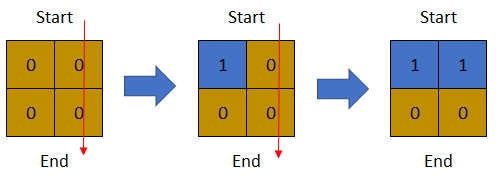

#### 1970. 你能穿过矩阵的最后一天

给你一个下标从 **1** 开始的二进制矩阵，其中 `0` 表示陆地，`1` 表示水域。同时给你 `row` 和 `col` 分别表示矩阵中行和列的数目。

一开始在第 0 天，整个 矩阵都是 陆地 。但每一天都会有一块新陆地被 水 淹没变成水域。给你一个下标从 1 开始的二维数组 cells ，其中 cells[i] = [ri, ci] 表示在第 i 天，第 ri 行 ci 列（下标都是从 1 开始）的陆地会变成 水域 （也就是 0 变成 1 ）。

你想知道从矩阵最 上面 一行走到最 下面 一行，且只经过陆地格子的 最后一天 是哪一天。你可以从最上面一行的 任意 格子出发，到达最下面一行的 任意 格子。你只能沿着 四个 基本方向移动（也就是上下左右）。

请返回只经过陆地格子能从最 **上面** 一行走到最 **下面** 一行的 **最后一天** 。

**示例 1：**


```shell
输入：row = 2, col = 2, cells = [[1,1],[2,1],[1,2],[2,2]]
输出：2
解释：上图描述了矩阵从第 0 天开始是如何变化的。
可以从最上面一行到最下面一行的最后一天是第 2 天。
```

**示例 2：**



```shell
输入：row = 2, col = 2, cells = [[1,1],[1,2],[2,1],[2,2]]
输出：1
解释：上图描述了矩阵从第 0 天开始是如何变化的。
可以从最上面一行到最下面一行的最后一天是第 1 天。
```

**示例 3：**


```shell
输入：row = 3, col = 3, cells = [[1,2],[2,1],[3,3],[2,2],[1,1],[1,3],[2,3],[3,2],[3,1]]
输出：3
解释：上图描述了矩阵从第 0 天开始是如何变化的。
可以从最上面一行到最下面一行的最后一天是第 3 天。
```

**提示：**

* 2 <= row, col <= 2 * 104
* 4 <= row * col <= 2 * 104
* cells.length == row * col
* 1 <= ri <= row
* 1 <= ci <= col
* cells 中的所有格子坐标都是 唯一 的。

### 题解

**并查集**

```java
class Solution {

    int[] dx = new int[]{1, -1, 0, 0,};
    int[] dy = new int[]{0, 0, -1, 1};

    public int latestDayToCross(int row, int col, int[][] cells) {
        int n = row * col + 2;
        UnionFind unionFind = new UnionFind(n);
        int floor = row * col;
        int ceil = row * col + 1;
        int[][] grid = new int[row][col];
        for (int i = 0; i < row; i++) {
            // 0表示陆地,1表示水域
            Arrays.fill(grid[i], 0);
        }

        // 将所有的陆地都覆盖掉,然后从最后一天开始往前将水域变成陆地
        for (int i = 0; i < cells.length; i++) {
            int x = cells[i][0] - 1;
            int y = cells[i][1] - 1;
            grid[x][y] = 1;
        }

        // 将第一行所有为0的点与ceil连接起来
        for (int i = 0; i < col; i++) {
            if (grid[0][i] == 0) {
                unionFind.union(i, ceil);
            }
        }

        // 将最后一行所有为0的点与floor连接起来
        for (int i = 0; i < col; i++) {
            if (grid[row - 1][i] == 0) {
                unionFind.union((row - 1) * col + i, floor);
            }
        }

        for (int i = cells.length - 1; i >= 0; i--) {
            if (unionFind.isConnected(ceil, floor)) {
                return i + 1;
            }
            int x = cells[i][0] - 1;
            int y = cells[i][1] - 1;
            grid[x][y] = 0;

            if (x == 0) {
                unionFind.union(y, ceil);
            }

            if (x == row - 1) {
                unionFind.union(x * col + y, floor);
            }

            for (int j = 0; j < 4; j++) {
                int nx = x + dx[j];
                int ny = y + dy[j];
                if (nx < 0 || nx >= row || ny < 0 || ny >= col || grid[nx][ny] == 1) {
                    continue;
                }
                unionFind.union(x * col + y, nx * col + ny);
            }
        }

        return -1;
    }

    private class UnionFind {
        public int[] parent;
        public int[] rank;

        public UnionFind(int size) {
            this.parent = new int[size];
            this.rank = new int[size];

            for (int i = 0; i < size; ++i) {
                parent[i] = i;
            }

            for (int i = 0; i < size; i++) {
                rank[i] = 1;
            }
        }

        public boolean isConnected(int u, int v) {
            int rootu = find(u);
            int rootv = find(v);
            return rootu == rootv;
        }

        public int find(int element) {
            if (parent[element] == element) {
                return element;
            }

            return parent[element] = find(parent[element]);
        }

        public void union(int element1, int element2) {
            int rootx = find(element1);
            int rooty = find(element2);
            if (rootx != rooty) {
                if (rank[rootx] > rank[rooty]) {
                    parent[rooty] = rootx;
                } else if (rank[rootx] < rank[rooty]) {
                    parent[rootx] = rooty;
                } else {
                    parent[rooty] = rootx;
                    rank[rootx] += 1;
                }
            }
        }
    }
}
```

