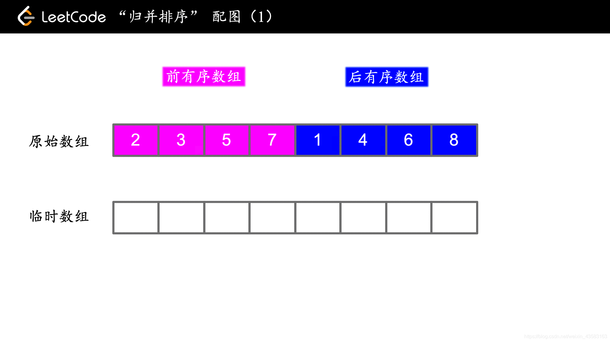
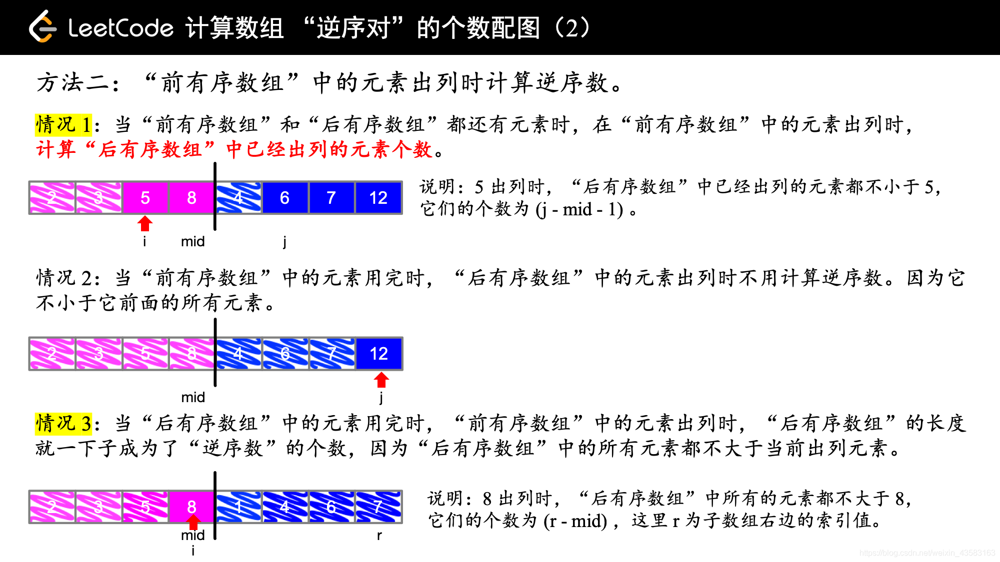
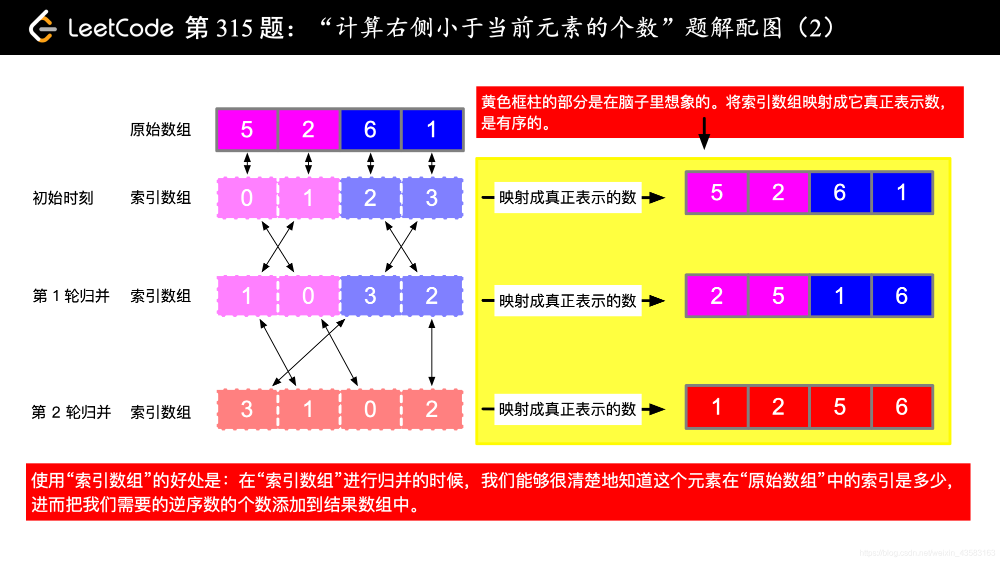
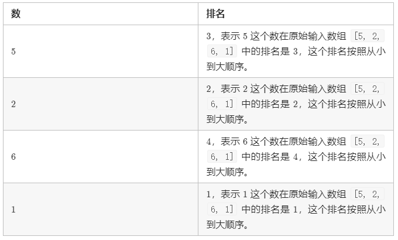

## 题目 315. 计算右侧小于当前元素的个数

### 方法一 归并排序

给定一个整数数组 nums，按要求返回一个新数组 counts。数组 counts 有该性质： counts[i] 的值是 nums[i] 右侧小于 nums[i] 的元素的数量。

**示例：**

>输入: [5,2,6,1]
>输出: [2,1,1,0]
>解释:
>5 的右侧有 2 个更小的元素 (2 和 1).
>2 的右侧仅有 1 个更小的元素 (1).
>6 的右侧有 1 个更小的元素 (1).
>1 的右侧有 0 个更小的元素.

## 解题思路

普通遍历算法肯定超时，应该思考如何简化算法。

这里采用 归并排序 + 索引数组的算法

整个的思路是这样子的：

在归并排序的过程中，统计每个前有序数组中每个数的逆序数个数。

我们首先要知道什么是归并排序，这个在排序算法中有讲，我就不说了。

然后要在归并排序的过程中，统计每个数的逆序数的个数。

那么如何统计逆序数的个数呢？我们在归并的时候，总是将数组分割为两部分，然后将两部分进行排序，分为前有序数组和后有序数组。



求解 “逆序对” 的关键在于：当其中一个数字放进最终归并以后的有序数组中的时候，这个数字与之前看过的数字个数（或者是未看过的数字个数）可以直接统计出来，而不必一个一个数”。

而本题目的要求是：让我们求 “在一个数组的某个元素的右边，比自己小的元素的个数”
因此，我们就 应该在 “前有序数组” 的元素出列的时候，数一数 “后有序数组” 已经出列了多少元素，因为这些已经出列的元素都比当前出列的元素要小（或者等于）。下面这幅图可能比较好理解。



但是与此同时，我们也发现一个问题，归并排序后，数组的下标会发生变化，那要怎样去定位原始数组的下标呢？这里采用一个索引数组的办法。索引数组的原理是这样的：



也就是说，我们不管归并之后怎么变化，用一个临时数组来记录原数组的下标。这样在统计每个数的数量时候，就能够精确定位

## 总结：

1、我们借助计算 “逆序数” 的思路完成本题，关键在于这里我们只能在 “前有序数组” 出列的时候计算逆序数；这点很关键，一定要弄清楚逆序数的求法。

如果题目让我们计算 “nums[i] 左侧小于 nums[i] 的元素的数量” 可以在 “后有序数组” 出列的时候计算逆序数；
2、体会 “索引数组” 这个使用技巧。

```java
import java.util.ArrayList;
import java.util.List;

public class Solution {

    private int[] temp;
    private int[] counter;
    private int[] indexes;

    public List<Integer> countSmaller(int[] nums) {
        List<Integer> res = new ArrayList<>();
        int len = nums.length;
        if (len == 0) {
            return res;
        }
        temp = new int[len];
        counter = new int[len];
        indexes = new int[len];
        for (int i = 0; i < len; i++) {
            indexes[i] = i;
        }
        mergeAndCountSmaller(nums, 0, len - 1);
        for (int i = 0; i < len; i++) {
            res.add(counter[i]);
        }
        return res;
    }

    /**
     * 针对数组 nums 指定的区间 [l, r] 进行归并排序，在排序的过程中完成统计任务
     *
     * @param nums
     * @param l
     * @param r
     */
    private void mergeAndCountSmaller(int[] nums, int l, int r) {
        if (l == r) {
            // 数组只有一个元素的时候，没有比较，不统计
            return;
        }
        int mid = l + (r - l) / 2;
        mergeAndCountSmaller(nums, l, mid);
        mergeAndCountSmaller(nums, mid + 1, r);
        // 归并排序的优化，同样适用于该问题
        // 如果索引数组有序，就没有必要再继续计算了
        if (nums[indexes[mid]] > nums[indexes[mid + 1]]) {
            mergeOfTwoSortedArrAndCountSmaller(nums, l, mid, r);
        }
    }

    /**
     * [l, mid] 是排好序的
     * [mid + 1, r] 是排好序的
     *
     * @param nums
     * @param l
     * @param mid
     * @param r
     */
    private void mergeOfTwoSortedArrAndCountSmaller(int[] nums, int l, int mid, int r) {
        // 3,4  1,2
        for (int i = l; i <= r; i++) {
            temp[i] = indexes[i];
        }
        int i = l;
        int j = mid + 1;
        // 左边出列的时候，计数
        for (int k = l; k <= r; k++) {
            if (i > mid) {
                indexes[k] = temp[j];
                j++;
            } else if (j > r) {
                indexes[k] = temp[i];
                i++;
                // 此时 j 用完了，[7,8,9 | 1,2,3]
                // 之前的数就和后面的区间长度构成逆序
                counter[indexes[k]] += (r - mid);
            } else if (nums[temp[i]] <= nums[temp[j]]) {
                indexes[k] = temp[i];
                i++;
                // 此时 [4,5, 6   | 1,2,3 10 12 13]
                //           mid          j
                counter[indexes[k]] += (j - mid - 1);
            } else {
                // nums[indexes[i]] > nums[indexes[j]] 构成逆序
                indexes[k] = temp[j];
                j++;
            }
        }
    }

    public static void main(String[] args) {
        int[] nums = new int[]{5, 2, 6, 1};
        Solution solution = new Solution();
        List<Integer> countSmaller = solution.countSmaller(nums);
        System.out.println(countSmaller);
    }
}
```

### 方法二 树状数组

写在前面：

* 「树状数组」属于高级的数据结构，如果是非竞赛选手和普通公司面试，可以不用掌握（这条意见仅供参考）。但我个人认为「树状数组」的构造是很巧妙的，希望我的介绍能给大家带来一点帮助和思考；
* **「树状数组」这个数据结构用于高效地解决「前缀和查询」与「单点更新」问题**；
* 本题解只介绍「树状数组」的基础知识。

### 离散化

首先对数组元素做预处理，这一步叫「离散化」。

- 考虑到「树状数组」的底层是数组（线性结构），为了避免开辟多余的「树状数组」空间，需要进行「离散化」；
- 「离散化」的作用是：针对数值的大小做一个排名的「映射」，把原始数据映射到 `[1, len]` 这个区间，这样「树状数组」底层的数组空间会更紧凑，更易于维护。

相对于数组中的值，更有用的是数组中的元素的「排名」，「离散化」以后得到一个排名表。对于示例输入: `[5, 2, 6, 1]` 得到的「排名表」为如下：



「离散化」并不影响最终结果，即示例输入: [5, 2, 6, 1] ，改成它的排名是 [3, 2, 4, 1] ，得到的结果是一样的，可以手动验证一下（因为我们只关心元素的相对大小，这一点上面也有所提及）。

## 思路分析

因为我们关心「**当前位置的右边比当前数值小的元素的个数**」，因此可以设计如下的算法流程：

- 从右向左读取排名；

- 先查询**严格小于**当前排名的「前缀和」，这里「前缀和」指的是，严格小于当前排名的元素的个数，这一步对应「前缀和查询」；

- 然后给「当前排名」加 11，这一步对应「单点更新」。

说明：上面两步可以交换。

我们根据上面的步骤，针对 `[5, 2, 6, 1]` 得到排名 `[3, 2, 4, 1]` ，把具体的计算过程写一下：

- 第 1 步：读到 1 。

1 的排名是 1，首先先在「树状数组」的下标 1 位置更新，执行的操作是 +1，很明显，在排名 1 之前肯定没有数了（查询排名在 1 之前的数有多少个），所以在结果数组的最后一个位置填 0。

- 第 2 步：读到 6。

6 的排名是 4，首先先在「树状数组」的下标 4 位置更新，执行的操作是 +1，接下来在「树状树组」里面执行一次查询，查询在排名 4 之前的元素个数有多少，结果是 1，所以在结果数组的倒数第 2 个位置填 1；

- 第 3 步：读到 2。

2 的排名是 2，首先先在「树状数组」的下标 2 位置更新，执行的操作是 +1，接下来在「树状树组」里面执行一次查询，查询在排名 2 之前的元素个数有多少，结果是 1，所以在结果数组的倒数第 3 个位置填 1；

- 第 4 步：读到 5。

5 的排名是 3，首先先在「树状数组」的下标 3 位置更新，执行的操作是 +1，接下来在「树状树组」里面执行一次查询，查询在排名 3 之前的元素个数有多少，结果是 2，所以在结果数组的倒数第 4 个位置填 2。

于是 `[2, 1, 1, 0]` 即为所求。

**参考代码 **：

```java
import java.util.ArrayList;
import java.util.Collections;
import java.util.HashMap;
import java.util.List;
import java.util.Map;
import java.util.Set;
import java.util.TreeSet;

public class Solution {

    public List<Integer> countSmaller(int[] nums) {
        List<Integer> res = new ArrayList<>();
        int len = nums.length;
        if (len == 0) {
            return res;
        }

        // 使用二分搜索树方便排序
        Set<Integer> set = new TreeSet();
        for (int i = 0; i < len; i++) {
            set.add(nums[i]);
        }

        // 排名表
        Map<Integer, Integer> map = new HashMap<>();
        int rank = 1;
        for (Integer num : set) {
            map.put(num, rank);
            rank++;
        }

        FenwickTree fenwickTree = new FenwickTree(set.size() + 1);
        // 从后向前填表
        for (int i = len - 1; i >= 0; i--) {
            // 1、查询排名
            rank = map.get(nums[i]);
            // 2、在树状数组排名的那个位置 + 1
            fenwickTree.update(rank, 1);
            // 3、查询一下小于等于“当前排名 - 1”的元素有多少
            res.add(fenwickTree.query(rank - 1));
        }
        Collections.reverse(res);
        return res;
    }


    private class FenwickTree {
        private int[] tree;
        private int len;

        public FenwickTree(int n) {
            this.len = n;
            tree = new int[n + 1];
        }

        // 单点更新：将 index 这个位置 + 1
        public void update(int i, int delta) {
            // 从下到上，最多到 size，可以等于 size
            while (i <= this.len) {
                tree[i] += delta;
                i += lowbit(i);
            }
        }


        // 区间查询：查询小于等于 index 的元素个数
        // 查询的语义是"前缀和"
        public int query(int i) {
            // 从右到左查询
            int sum = 0;
            while (i > 0) {
                sum += tree[i];
                i -= lowbit(i);
            }
            return sum;
        }

        public int lowbit(int x) {
            return x & (-x);
        }
    }


    public static void main(String[] args) {
        int[] nums = new int[]{5, 2, 6, 1};
        Solution solution = new Solution();
        List<Integer> countSmaller = solution.countSmaller(nums);
        System.out.println(countSmaller);
    }
}
```

**复杂度分析**

