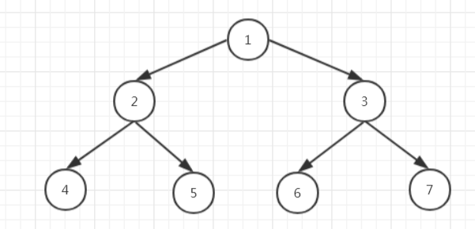
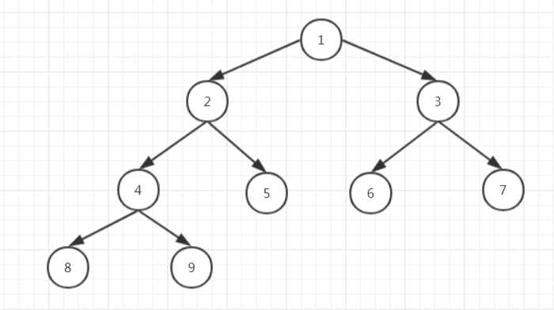
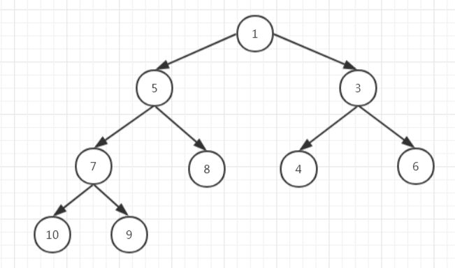
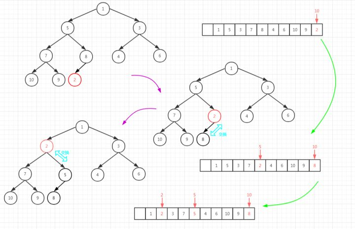
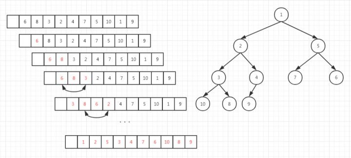
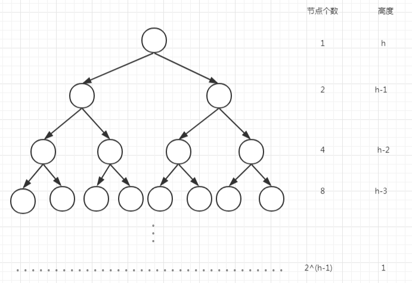
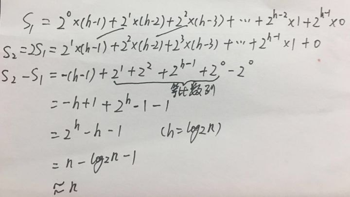

# 堆排序

## 何为堆？

堆是一种特殊的树，只要满足下面两个条件，它就是一个堆：

（1）堆是一颗完全二叉树；

（2）堆中某个节点的值总是不大于（或不小于）其父节点的值。

其中，我们把根节点最大的堆叫做大顶堆，根节点最小的堆叫做小顶堆。

## 堆详解

### 满二叉树

满二叉树是指所有层都达到最大节点数的二叉树。比如，下面这颗树：




### 完全二叉树

完全二叉树是指除了最后一层其它层都达到最大节点数，且最后一层节点都靠左排列。比如，下面这颗树：



可见，其实满二叉树是一种特殊的完全二叉树。

那么，使用什么结构存储完全二叉树最节省空间呢？

我们可以看见，完全二叉树的节点都是比较紧凑的，且只有最后一层是不满的，所以使用数组是最节省空间的，比如上面这颗完全二叉树我们可以这样存储。


我们下标为0的位置不存储元素，从下标为1的位置开始存储元素，每层依次从左往右放到数组里来存储。

为什么下标0的位置不存在元素呢？

这是因为这样存储我们可以很方便地找到父节点，比如，4的父节点即4/2=2，5的父节点即5/2=2。

### 堆

堆也是一颗完全二叉树，但是它的元素必须满足每个节点的值都不大于（或不小于）其父节点的值。比如下面这个堆：



前面我们说过完全二叉树适合使用数组来存储，那上面这个堆应该怎么存储呢？

同样地，我们下标为0的位置不存在元素，最后就变成下面这样。


这时候我们要找8的父节点就拿8的位置下标5/2=2，也就是5这个节点的位置，这也是为了我们后面堆化。

### 插入元素

往堆中插入一个元素后，我们需要继续满足堆的两个特性，即：

（1）堆是一颗完全二叉树；

（2）堆中某个节点的值总是不大于（或不小于）其父节点的值。

为了满足条件（1），所以我们把元素插入到最后一层最后一个节点往后一位的位置，但是插入之后可能不再满足条件（2）了，所以这时候我们需要堆化。

比如，上面那个堆我们需要插入元素2，我们把它放在9后面，这时不满足条件（2）了，我们就需要堆化。（这是一个小顶堆）



将完全二叉树和数组对照着来看。

在完全二叉树中，插入的节点与它的父节点相比，如果比父节点小，就交换它们的位置，再往上和父节点相比，如果比父节点小，再交换位置，直到比父节点大为止。

在数组中，插入的节点与n/2位置的节点相比，如果比n/2位置的节点小，就交换它们的位置，再往前与n/4位置的节点相比，如果比n/4位置的节点小，再交换位置，直到比n/(2^x)位置的节点大为止。

这就是插入元素时进行的**堆化**，也叫自下而上的堆化。

从插入元素的过程，我们知道每次与n/(2^x)的位置进行比较，所以，插入元素的时间复杂度为O(log n)。

### 删除堆顶元素

我们知道，在小顶堆中堆顶存储的是最小的元素，这时候我们把它删除会怎样呢？

删除了堆顶元素后，要使得还满足堆的两个特性，首先，我们可以把最后一个元素移到根节点的位置，这时候就满足条件（1），之后就是使它满足条件（2），就需要堆化了。


将完全二叉树和数组对照着来看。

在完全二叉树中，把最后一个节点放到堆顶，然后与左右子节点中小的交换位置（因为是小顶堆），依次往下，直到其比左右子节点都小为止。

在数组中，把最后一个元素移到下标为1的位置，然后与下标为2和3的位置对比，发现8比2大，且2是2和3中间最小的，所以与2交换位置；然后再下标为4和5的位置对比，发现8比5大，且5是5和7中最小的，所以与5交换位置，没有左右子节点了，堆化结束。

这就是删除元素时进行的**堆化**，也叫自上而下的堆化。

从删除元素的过程，我们知道把最后一个元素拿到根节点后，每次与2n和(2n+1)位置的元素比较，取其小者，所以，删除元素的时间复杂度也为O(log n)。

### 建堆

假定给定一组乱序的数组，我们该怎么建堆呢？

如下图所示，我们模拟依次往堆中添加元素。

（1）插入6这个元素，只有一个，不需要比较；

（2）插入8这个元素，比6大，不需要交换；

（3）插入3这个元素，比下标3/2=1的位置上的元素6小，交换位置；

（4）插入2这个元素，比下标4/2=2的位置上的元素8小，交换位置，比下标2/2=1的位置上的元素3小，交换位置；

（5）...

（10）最后，全部插入完成，即完成了建堆的过程。



我们知道，完全二叉树的高度h=log n，且第h层有1个元素，第(h-1)层有2个元素，第(h-2)层有2^2个元素，...，第1层有2^(h-1)个元素。



其实，建堆的整个过程中一个节点的比较次数是与它的高度k成正比的，比如，上图中的1这个元素，它也是从最后一层依次比较了3次（高度h=4），才到达了现在的位置。

所以，我们可以得出第h层的元素有1个，它最多需要比较(h-1)次；第(h-1)层有2个元素，它们最多比较(h-2)次；第(h-2)层有2^2个元素，它们最多比较(h-3)次；...；第1层有2^(h-1)个元素，它们最多比较0次。

因而，总和就如下图：



所以，建堆的时间复杂度就是O(n)。

### 堆排序

我们知道，对于小顶堆，堆顶存储的元素就是最小的。

那么，我们删除堆顶元素，堆化，第二小的跑堆顶了，再删除，再堆化，...，这些删除的元素是不是正好有序的？

当然是的，所以堆排序的过程就很简单了。

我们直接把堆顶的元素与第n个元素交换位置，再把前(n-1)个元素堆化，再把堆顶元素与第(n-1)个元素交换位置，再把前(n-2)个元素堆化，..，，进行下去，最后，数组中的元素就整个变成倒序的了，也就排序完了。

我们知道删除一个元素的时间复杂度是O(log n)，那么删除n个元素正好是：

log n + log(n-1) + log(n-2) + log 1

这个公式约等于nlog n，所以堆排序的时间复杂度为O(nlog n)。

而且，这样排序不需要占用额外的空间，只需要交换元素的需要一个临时变量，所以堆排序的空间复杂度为O(1)。

## 总结

（1）堆是一颗完全二叉树；

（2）小（大）顶堆中的每一个节点都不小于（不大于）它的父节点；

（3）堆的插入、删除元素的时间复杂度都是O(log n)；

（4）建堆的时间复杂度是O(n)；

（5）堆排序的时间复杂度是O(nlog n)；

（6）堆排序的空间复杂度是O(1)；

## 彩蛋

堆都有哪些应用呢？

其实，堆除了堆排序以外，还有很多其它的用途，比如求中位数，99%位数，定时任务等。

比如，求中位数的大致思路，是分别建立一个大顶堆和一个小顶堆，然后往这两个堆中放元素，当其中一个堆的元素个数比另外一个多2时，就平衡一下，这样所有元素都放完之后，两个堆顶的元素之一（或之二）就是中位数。

**代码**

```java
// 堆排序
	public static void heapSort(int[] arr) {
		if (arr == null || arr.length < 2) {
			return;
		}
		// 建立大根堆
		for (int i = 0; i < arr.length; i++) {
			heapInsert(arr, i);
		}
		// 先将大根堆的根放到数组的最后(大根堆的根即为数组的最大值)
		// 然后将数组减1，并调整剩余的大根堆
		int size = arr.length;
		swap(arr, 0, --size);
		while (size > 0) {
			heapify(arr, 0, size);
			swap(arr, 0, --size);
		}
	}

	// 不断往大根堆添加数的过程
	public static void heapInsert(int[] arr, int index) {
		// 若当前节点比父节点大，则将当前节点与父节点交换
		// 并将该节点移动到父节点
		// 依次类推，直到当前节点不比父节点大为止
		while (arr[index] > arr[(index - 1) / 2]) {
			swap(arr, index, (index - 1) / 2);
			index = (index - 1) / 2;
		}
	}

	public static void heapify(int[] arr, int index, int size) {
		// 当前节点的左孩子
		// left+1为当前节点的右孩子
		int left = index * 2 + 1;
		while (left < size) {
			// 当前节点的右孩子存在，并且右孩子大于左孩子，选取右孩子，否则选择左孩子
			// 选择当前节点孩子中的最大节点
			int largest = left + 1 < size && arr[left + 1] > arr[left] ? left + 1 : left;
			// 在当前节点以及当前节点的孩子中选择最大值
			largest = arr[largest] > arr[index] ? largest : index;
			// 若当前节点和当期节点的孩子中的最大值是当前节点自身就退出循环
			if (largest == index) {
				break;
			}
			// 否则交换当前节与最大值
			swap(arr, largest, index);
			// 继续往下遍历
			index = largest;
			left = index * 2 + 1;
		}
	}

	public static void swap(int[] arr, int i, int j) {
		int tmp = arr[i];
		arr[i] = arr[j];
		arr[j] = tmp;
	}
```

