#### 面试题 17.18. 最短超串

假设你有两个数组，一个长一个短，短的元素均不相同。找到长数组中包含短数组所有的元素的最短子数组，其出现顺序无关紧要。

返回最短子数组的左端点和右端点，如有多个满足条件的子数组，返回左端点最小的一个。若不存在，返回空数组。

**示例 1:**

```shell
输入:
big = [7,5,9,0,2,1,3,5,7,9,1,1,5,8,8,9,7]
small = [1,5,9]
输出: [7,10]
```

**示例 2:**

```shell
输入:
big = [1,2,3]
small = [4]
输出: []
```

**提示：**

- `big.length <= 100000`
- `1 <= small.length <= 100000`

### 题解

废话不多说，直接看动画！

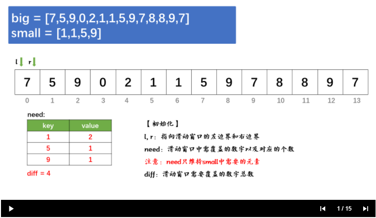

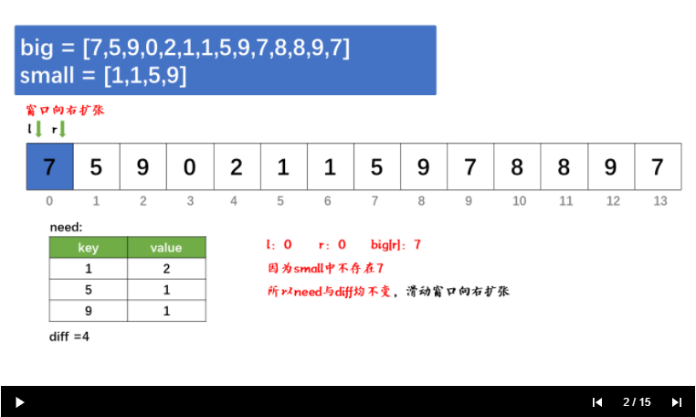

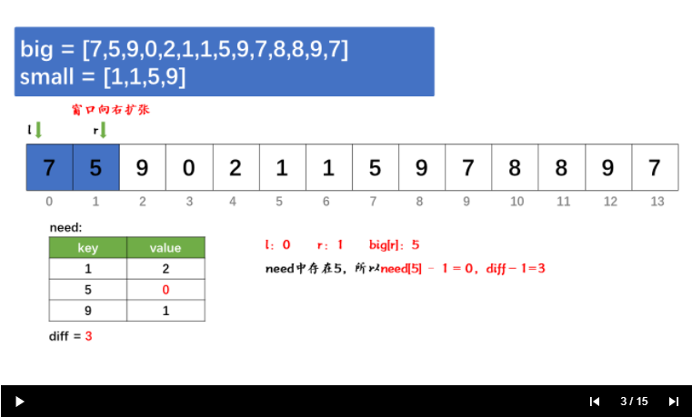

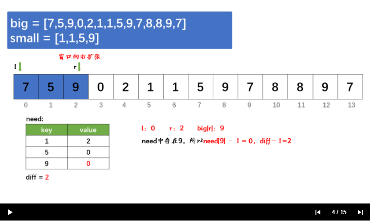

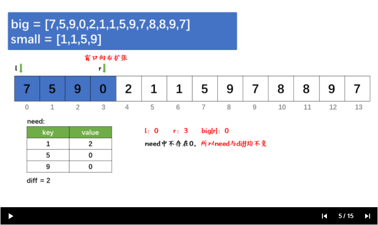

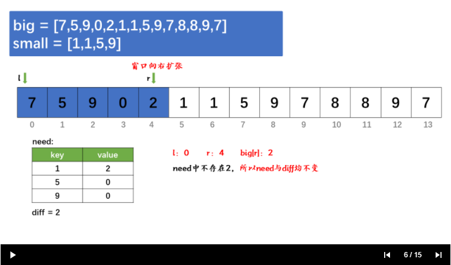

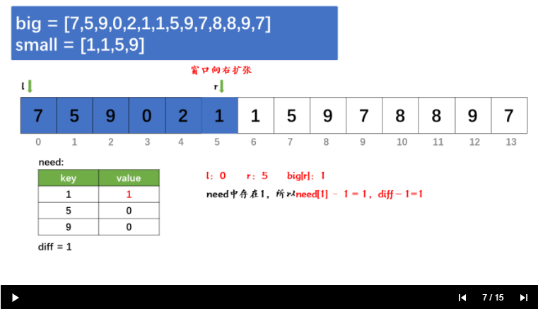

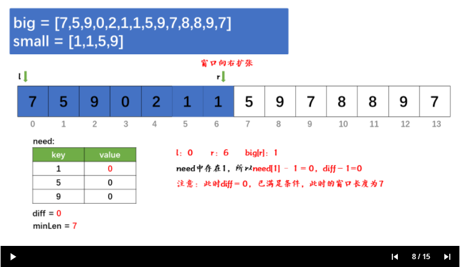

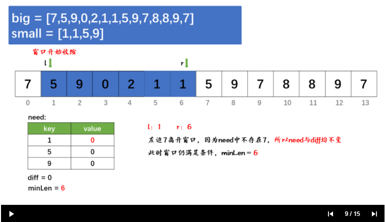

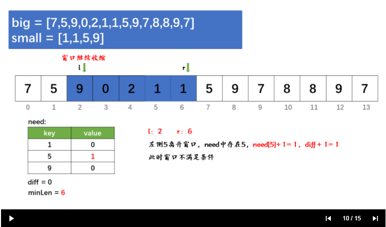

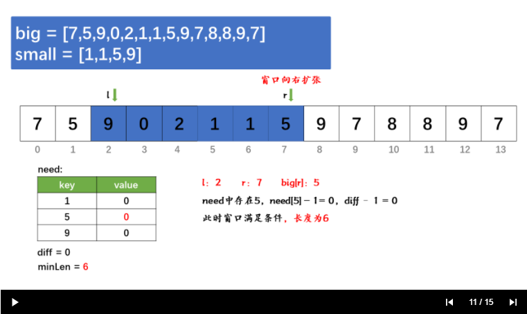

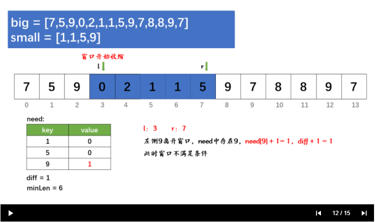

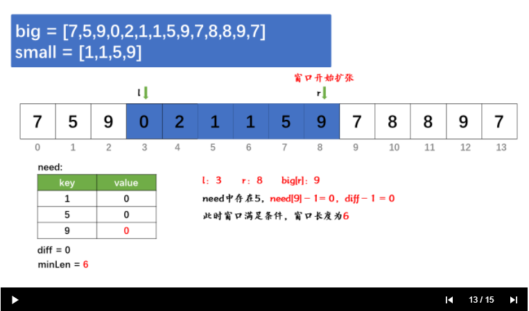

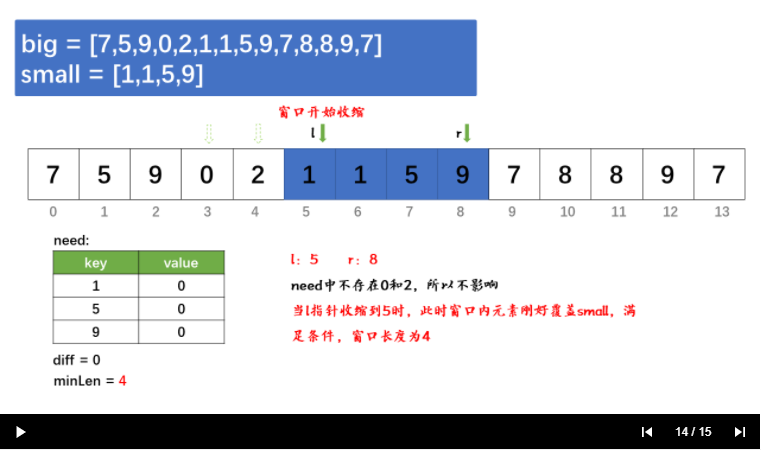

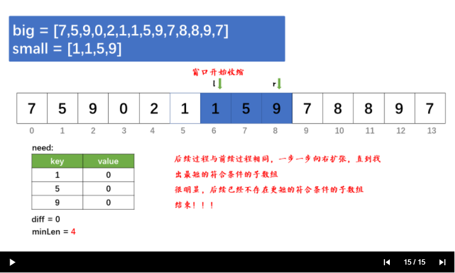

**1）步骤：**

1. 使用small数组初始化need，need存储small中的所有元素
2. 使用左、右指针l和r遍历big数组
3. 如果区间[l, r]内的元素未完全覆盖small(即diff != 0)，r右移
4. 如果区间[l, r]内的元素完全覆盖small(即diff == 0)，l左移，压缩区间，直到区间[l, r]不完全覆盖small数组
5. 重复步骤3-4，直到找到完全覆盖small数组的最短区间[l, r]

```java
class Solution {
    public int[] shortestSeq(int[] big, int[] small) {
        Map<Integer, Integer> need = new HashMap<>();
        int diff = 0;

        for (int num : small) {
            need.put(num, need.getOrDefault(num, 0) + 1);
            diff++;
        }

        int left = 0;
        int right = 0;
        int minLen = big.length;
        int[] ans = new int[]{};
        while (right < big.length) {
            if (need.containsKey(big[right])) {
                if (need.get(big[right]) > 0) {
                    diff--;
                }
                need.put(big[right], need.get(big[right]) - 1);
            }

            while (diff == 0) {
                if (right - left < minLen) {
                    minLen = right - left;
                    ans = new int[]{left, right};
                }

                if (need.containsKey(big[left])) {
                    need.put(big[left], need.get(big[left]) + 1);
                    if (need.get(big[left]) > 0) {
                        diff++;
                    }
                }
                left++;
            }
            right++;
        }
        return ans;
    }
}
```

```java
class Solution {
    public int[] shortestSeq(int[] big, int[] small) {
        Map<Integer, Integer> window = new HashMap<>();
        Map<Integer, Integer> need = new HashMap<>();

        for (int num : small) {
            need.put(num, need.getOrDefault(num, 0) + 1);
        }

        int left = 0;
        int right = 0;
        int valid = 0;
        int minLen = big.length;
        int[] ans = new int[]{};
        while (right < big.length) {
            if (need.containsKey(big[right])) {
                window.put(big[right], window.getOrDefault(big[right], 0) + 1);

                if (window.get(big[right]).equals(need.get(big[right]))) {
                    valid++;
                }
            }

            while (valid == need.size()) {
                if (right - left < minLen) {
                    minLen = right - left;
                    ans = new int[]{left, right};
                }
                if (need.containsKey(big[left])) {
                    if (window.get(big[left]).equals(need.get(big[left]))) {
                        valid--;
                    }
                    window.put(big[left], window.getOrDefault(big[left], 0) - 1);
                }
                left++;
            }
            right++;
        }
        return ans;
    }
}
```