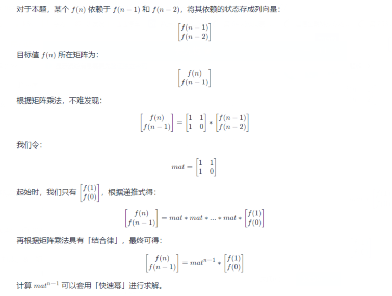

#### 剑指 Offer 10- I. 斐波那契数列

写一个函数，输入 `n` ，求斐波那契（Fibonacci）数列的第 `n` 项（即 `F(N)`）。斐波那契数列的定义如下：

```shell
F(0) = 0,   F(1) = 1
F(N) = F(N - 1) + F(N - 2), 其中 N > 1.
```

斐波那契数列由 0 和 1 开始，之后的斐波那契数就是由之前的两数相加而得出。

答案需要取模 1e9+7（1000000007），如计算初始结果为：1000000008，请返回 1。

**示例 1：**

```shell
输入：n = 2
输出：1
```

**示例 2：**

```shell
输入：n = 5
输出：5
```

**提示：**

- `0 <= n <= 100`

### 题解

## 递推实现动态规划

既然转移方程都给出了，直接根据转移方程从头到尾递递推一遍即可。

```java
class Solution {
    int mod = (int)1e9+7;
    public int fib(int n) {
        if (n <= 1) return n;
        int a = 0, b = 1;
        for (int i = 2; i <= n; i++) {
            int c = a + b;
            c %= mod;
            a = b;
            b = c;
        }
        return b;
    }
}
```

- 时间复杂度：O(n)
- 空间复杂度：O(1)

## 递归实现动态规划

能以「递推」形式实现动态规划，自然也能以「递归」的形式实现。

为防止重复计算，我们需要加入「记忆化搜索」功能，同时利用某个值 xx 在不同的样例之间可能会作为“中间结果”被重复计算，并且计算结果 fib(x)fib(x) 固定，我们可以使用 static 修饰缓存器，以实现计算过的结果在所有测试样例中共享。

```java
class Solution {
    static int mod = (int)1e9+7;
    static int N = 110;
    static int[] cache = new int[N];
    public int fib(int n) {
        if (n <= 1) return n;
        if (cache[n] != 0) return cache[n];
        cache[n] = fib(n - 1) + fib(n - 2);
        cache[n] %= mod;
        return cache[n];
    }
}
```

## 打表

经过「解法二」，我们进一步发现，可以利用数据范围只有 100100 进行打表预处理，然后直接返回。

```java
class Solution {
    static int mod = (int)1e9+7;
    static int N = 110;
    static int[] cache = new int[N];
    static {
        cache[1] = 1;
        for (int i = 2; i < N; i++) {
            cache[i] = cache[i - 1] + cache[i - 2];
            cache[i] %= mod;
        }
    }
    public int fib(int n) {
        return cache[n];
    }
}
```

- 时间复杂度：将打表逻辑放到本地执行，复杂度为 O(1)；否则为 O(C)，C为常量，固定为 110
- 空间复杂度：O(C)

## 矩阵快速幂

**对于数列递推问题，可以使用矩阵快速幂进行加速，**



```java
class Solution {
    int mod = (int)1e9+7;
    long[][] mul(long[][] a, long[][] b) {
        int r = a.length, c = b[0].length, z = b.length;
        long[][] ans = new long[r][c];
        for (int i = 0; i < r; i++) {
            for (int j = 0; j < c; j++) {
                for (int k = 0; k < z; k++) {
                    ans[i][j] += a[i][k] * b[k][j];
                    ans[i][j] %= mod;
                }
            }
        }
        return ans;
    }
    public int fib(int n) {
        if (n <= 1) return n;
        long[][] mat = new long[][]{
            {1, 1},
            {1, 0}
        };
        long[][] ans = new long[][]{
            {1},
            {0}
        };
        int x = n - 1;
        while (x != 0) {
            if ((x & 1) != 0) ans = mul(mat, ans);
            mat = mul(mat, mat);
            x >>= 1;
        }
        return (int)(ans[0][0] % mod);
    }
}
```

