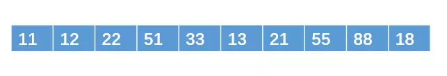
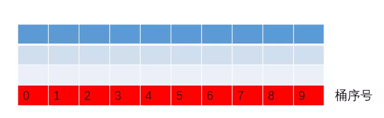
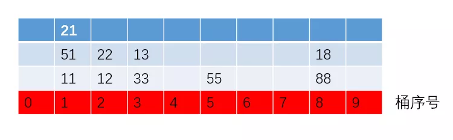
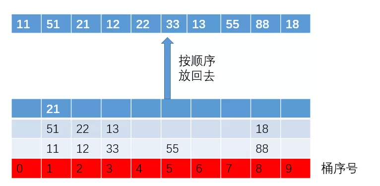
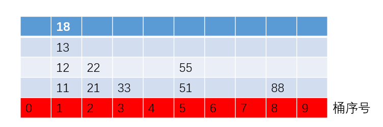
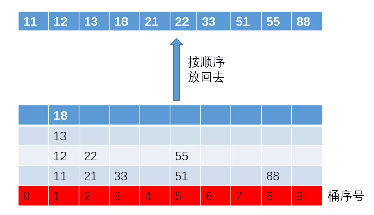
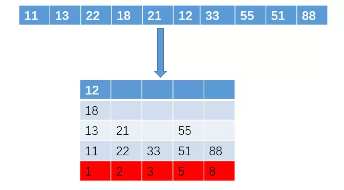
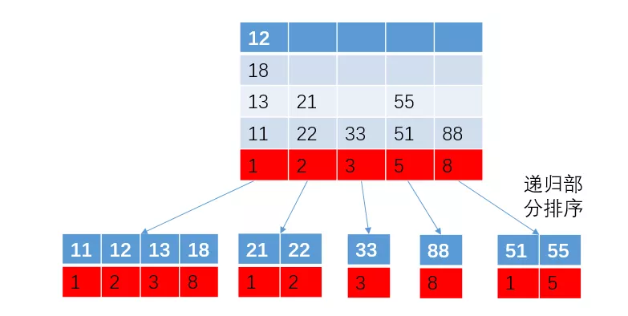
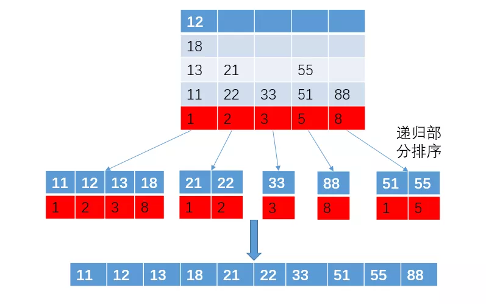

# 基数排序

老大：我简单给你讲下吧，你学过那么多排序，估计一看就懂了。基数排序，是一种基数“桶”的排序，他的排序思路是这样的：先以个位数的大小来对数据进行排序，接着以十位数的大小来多数进行排序，接着以百位数的大小……

排到最后，就是一组有序的元素了。不过，他在以某位数进行排序的时候，是采用“桶”来排序的，基本原理就是把具有相同个（十、百等）位数的数放进同一个桶里。我直接给你个例子吧，保证你一看就懂。

例如我们现在要对这组元素来排序：

由于我们是以每个数的某位数来排序的，这位数的范围是0-9，所以我们需要10个桶。

第一遍，先以个位数排序，把具有相同个位数的数放进桶里，结果如下：

之后再按照从0号桶到9号桶的顺序取出来，结果如下

个位数排序完成。

第二遍，以十位数来排，结果如下：

再取出来放回去：

十位数排序完成，最终的结果就是一组有序的元素。如果元素中有百位数的话，大不了就按照百位数再给他重复排一遍。

老二：那我想问下，为啥要从个位数开始排序呢？可以直接从最高位开始排序吗？如果从最高位开始排序的话，如果一个数最高位比另一个数大，那么这个数就一定比另外一个数大了，不用在比较次高位了。这样的话，不是可以排的更快吗？

老大：脑子反应的挺快啊。是的，是可以以最高位来排序的，而且也像你说的，以最高位来排序的话，是可以减少数据之间比较的次数。但我们仍然不建议以最高位来排序，因为他有个**致命的缺点**。

老大:还是以刚才那个例子吧，我们一边用最高位来排序，一边来寻找这个致命的缺点。数组如下(元素的顺序改变了一些)：

第一遍：最高位十位数排序，结果如下(有些没用到的桶给省略了):

显然，不在桶一个桶里的数，他们的大小顺序已经是已知的了，也就是说，**右边桶的数一定比左边桶的数大**，所有在接下来的个位数排序里，我们只需要进行“各部分”单独排序就可以了，每一小部分都类似于原问题的一个子问题，做的时候可以采用递归的形式来处理。

最后汇总，即可完成排序：

这种方法确实可以减少比较的次数，不过请大家注意，在每个小部分的排序中，我们也是需要10个桶来将他们进行排序，最后导致的结果就是，**每个不同值的元素都会占据一个“桶”**，如果你有1000个元素，并且1000个元素都是不同值的话，那么从最高位排序到最低位，需要1000个桶。

这样子的话，空间花费不仅大，而且看起来有点背离基数排序最初的思想了（“背离”这个词，个人感觉而已）。所以，我们一般采用从最低位到最高位的顺序哦。

**关于基数排序，还有以下几个问题，你不妨也想一想?**

1、基数排序是一种用空间换时间的排序算法，数据量越大，额外的空间就越大?

我的想法：我觉得基数排序并非是一种时间换空间的排序，也就是说，数据量越大，额外的空间并非就越大。因为在把元素放进桶的时候，是完全可以用指针指向这个元素的，也就是说，只有初始的那些桶才算是额外的空间。

2、居然额外空间不是限制基数排序速度的原因，那为啥基数排序没有快速排序快呢？

基数的时间复杂度为O(n)，不过他是忽略了常数项，即实际排序时间为kn(其中k是常数项)，然而在实际排序的过程中，这个常数项k其实是很大的，这会很大程度影响实际的排序时间，而像快速排序虽然是nlogn，但它前面的常数项是相对比较小的，影响也相对比较小。

需要说明的是，**基数排序也并非比快速排序慢**，这得看具体情况，（不要被标题所影响哈）。而且，数据量越大的话，基数排序会越有优势。

3、有人可能会问，说了这么多，那到底是基数排序快还是快速排序快呢？

对于这样的问题，我只能建议你，自己根据不同的场景，撸几行代码，自己测试一下。