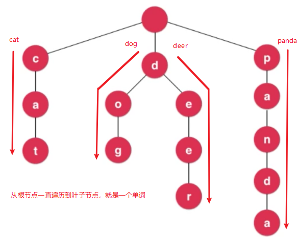
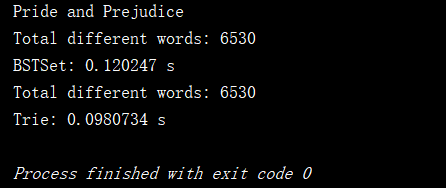
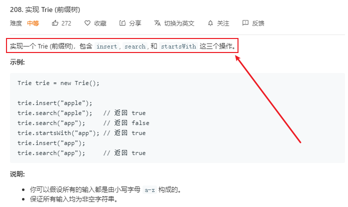
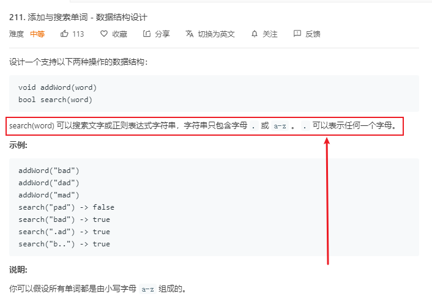
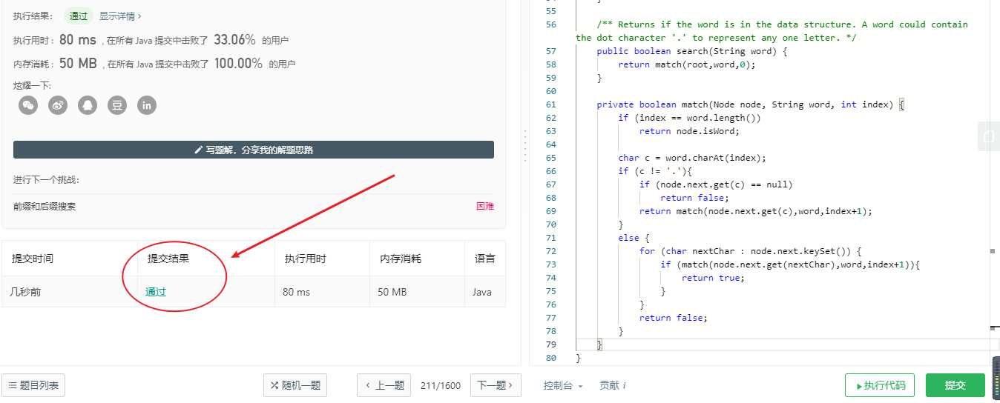
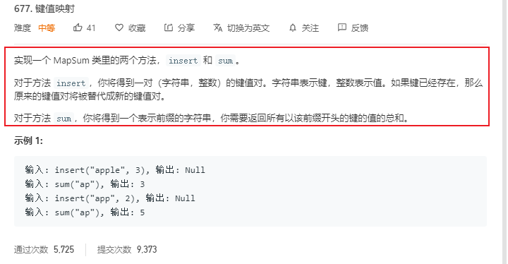

# Trie(字典树、前缀树）

### 什么是Trie?

​		Trie是一个多叉树，Trie专门为处理字符串而设计的。使用我们之前实现的[二分搜索树](https://www.cnblogs.com/reminis/p/12605606.html)来查询字典中的单词，查询的时间复杂度为O(logn),如果有100万（220）个单词，则logn大约等于20，但是使用Trie这种数据结构，查询每个条目的时间复杂度，和一共有多少个条目无关！时间复杂度为O（w），w为被查询单词的长度！大多数单词的长度小于10。

​		Trie将整个字符串以字母为单位，一个一个拆开，从根节点开始一直到叶子节点去遍历，就形成了一个单词，下图中的Trie就存储的四个单词(cat,dog,deer,panda)



​		每个节点有26个字母指向下个节点的指针，考虑不同的语言，不同的情境，比如现在这个26个字符是没有包含大写字母的，如果需要包含大写字母，则需要让每个节点有52个指向下个节点的指针，如果现在要加入邮箱呢？所以这里描述为每个节点有若干个指向下个节点的指针。

​		由于很多单词可能是另外一个单词的前缀，比如pan就是panda的前缀，那么再Trie中如何存储呢？所以我们应该对节点添加一个标识符，判断该节点是否是某个单词的结尾，某一个单词的结尾只靠叶子节点是不能区别出来的，因此我们再设计Node节点时，应该添加一个IsWord，判断该节点是否是单词的结尾。

### 创建一棵Trie

​		在创建Trie之前，我们需要先设计Trie的节点类，根据上面说的，每个节点都有若干个指向下个节点的指针，还需要一个isWord来判断是否是单词的结尾，代码实现如下：

```java
 //设计Trie的节点类
    private class Node{
        
        //判断是否是一个单词
        public boolean isWord;
        //每个节点有若干个指向下个节点的指针
        public TreeMap<Character,Node> next;

        //有参构造：对该节点进行初始化
        public Node(boolean isWord){
            this.isWord = isWord;
            next = new TreeMap<>();
        }
        
        //无参构造：默认当前节点不是单词的结尾
        public Node(){
            this(false);
        }

    }
```

现在就让我们来实现一个Trie

```java
public class Trie {

    //设计Trie的节点类
    private class Node{

        //判断是否是一个单词
        public boolean isWord;
        //每个节点有若干个指向下个节点的指针
        public TreeMap<Character,Node> next;

        //有参构造：对该节点进行初始化
        public Node(boolean isWord){
            this.isWord = isWord;
            next = new TreeMap<>();
        }

        //无参构造：默认当前节点不是单词的结尾
        public Node(){
            this(false);
        }

    }

    private Node root;
    private int size;

    public Trie() {
        root = new Node();
        size = 0;
    }

    // 获得Trie中存储的单词数量
    public int getSize(){
        return size;
    }
}
```

### 向Trie中添加元素

​		Trie的添加操作：添加的是一个字符串，要把这个字符串拆成一个一个字符，把这一个一个字符作为一个一个节点，存入Trie中。

```java
 //向Trie中添加一个新的单词word
    public void add(String word){
        Node cur = root;
        for (int i = 0 ;i < word.length(); i++){
            //将这个新单词，拆成一个一个字符
            char c = word.charAt(i);
            //如果当前节点的若干个子节点中，没有存储当前字符的节点，则需要创建一个子节点，存储当前字符
            if (cur.next.get(c) == null){
                cur.next.put(c,new Node());
            }
            cur = cur.next.get(c);
        }
        //对添加的新单词遍历结束后，判断当前节点是否为单词的结尾,如果不是我们才对size加一，并且维护当前节点的isWord
        if (! cur.isWord){
            cur.isWord = true;
            size ++;
        }

    }
```

### Trie的查询操作

```java
  //Tire的查询操作
    public boolean contains(String word){
        Node cur = root;
        for (int i = 0;i < word.length(); i++){
            char c = word.charAt(i);
            if (cur.next.get(c) == null ){
                return false;
            }
            cur = cur.next.get(c);
        }
        return cur.isWord;
    }
```

与查询类型，我们可以写一个是否存在以某个单词为前缀的单词

```java
 //查询在Trie中是否有单词以prefix为前缀
    public boolean isPrefix(String prefix){
        Node cur = root;
        for (int i = 0; i < prefix.length(); i++){
            char c = prefix.charAt(i);
            if (cur.next.get(c) == null) 
                return false;
            cur = cur.next.get(c);
        }
        return true;
    }
```

### 对比二分搜索树和Trie的性能

```java
  public static void main(String[] args) {
        System.out.println("Pride and Prejudice");

        List<String> words = new ArrayList<>();

        if(FileOperation.readFile("pride-and-prejudice.txt", words)){
//            Collections.sort(words);

            long startTime = System.nanoTime();

            //使用基于二分搜索树实现的集合进行添加和查询操作
            BSTSet<String> set = new BSTSet<>();
            for(String word: words)
                set.add(word);

            for(String word: words)
                set.contains(word);

            long endTime = System.nanoTime();

            double time = (endTime - startTime) / 1000000000.0;
            //基于二分搜索树实现的集合进行添加和查询操作所花费的时间
            System.out.println("Total different words: " + set.getSize());
            System.out.println("BSTSet: " + time + " s");

            // --- 测试通过Trie通过添加和查询所需要的时间

            startTime = System.nanoTime();

            Trie trie = new Trie();
            for(String word: words)
                trie.add(word);

            for(String word: words)
                trie.contains(word);

            endTime = System.nanoTime();

            time = (endTime - startTime) / 1000000000.0;

            System.out.println("Total different words: " + trie.getSize());
            System.out.println("Trie: " + time + " s");
        }

    }
```



​		通过上面测试代码可以看出，其实数据量不大的情况下，对于一个随机字符串的集合，使用二分搜索书和Trie进行添加和查询操作，差别是不大的，如果我们加入的数据是有序的，这时二分搜索树就会退化成链表，时间复杂度就为O（n），运行效率是很低的，但是Trie并不受影响，我们可以对words进行排序后，在看一下运行结果:


通过上面的测试，可以看出对有序的数据进行添加和查询操作，差距是特别大的。

### leetcode上的问题

  我们可以看到leetcode官网上的208好问题，就是实现一个Trie



其实从题目描述中就可以看出，这个问题中的三个方法就是我们实现的add(),contains(),isPrefix()操作，直接将我们写的代码改个方法名字提交就可以通过了。


我们再来看一道leetcode上的211号问题：添加与搜索单词



通过题目描述，我们会发现只是查询操作和我们实现的Trie有所不同，添加操作没有发改变。由于字符'.'可以代表任何一个字母，所以我们对于'.'，需要遍历所有的可能。

```java
  public boolean search(String word) {
        //递归匹配查找
        return match(root,word,0);
    }

    private boolean match(Node node, String word, int index) {
        if (index == word.length())
            return node.isWord;

        char c = word.charAt(index);
        if (c != '.'){
            if (node.next.get(c) == null)
                return false;
            return match(node.next.get(c),word,index+1);
        }
        else {
            //如果当前节点的的值为‘.’,则需要遍历当前节点的所有子节点
            for (char nextChar : node.next.keySet()) {
                if (match(node.next.get(nextChar),word,index+1)){
                    return true;
                }
            }
            return false;
        }
    }
```

代码提交到leetcode后，就会提示通过了



我们再来看看leetcode上的677号问题：Map Sum Pairs(键值映射)



根据题目描述，我们可以理解为：映射中存储的是单词和权重值。sum()方法是求得包含这个前缀单词得权重和
代码实现如下：

```java
 //设计节点类
    private class Node{
        //单词的权重值
        public int value;
        //每个节点都可能有若干个子节点
        public TreeMap<Character,Node> next;

        public Node(int value){
            this.value = value;
            next = new TreeMap<>();
        }

        public Node(){
            this(0);
        }
    }

    private Node root;

    public MapSum(){
        root = new Node();
    }

    //添加操作和我们实现的字典树中的添加操作类型
    public void insert(String word,int val){
        Node cur = root;

        for (int i = 0 ; i < word.length() ; i++){
            char c = word.charAt(i);
            if (cur.next.get(c) == null){
                cur.next.put(c,new Node());
            }
            cur = cur.next.get(c);
        }
        cur.value = val;
    }

    //求前缀为prefix的权重和
    public int sum(String prefix){
        Node cur = root;
        for (int i = 0 ; i < prefix.length() ; i++){
            char c = prefix.charAt(i);
            if ( cur.next.get(c) == null ){
                return 0;
            }
            cur = cur.next.get(c);
        }
        return sum(cur);
    }

    private int sum(Node node) {
        int res = node.value;
        for (char c : node.next.keySet()) {
            res += sum(node.next.get(c));
        }
        return res;
    }

```

leetcode上的提交结果：

