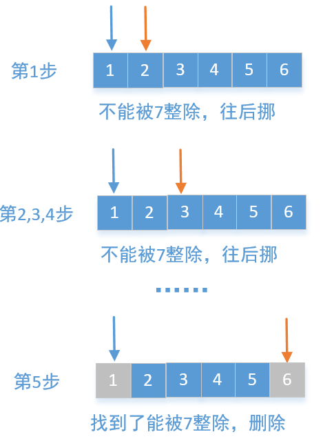
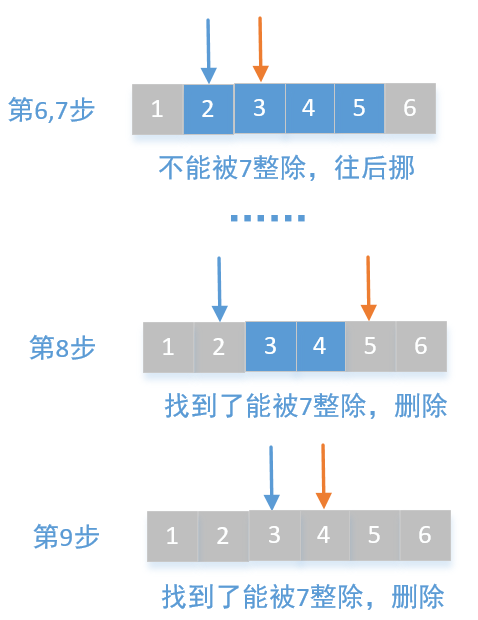

#### 1497. 检查数组对是否可以被 k 整除

给你一个整数数组 `arr` 和一个整数 `k` ，其中数组长度是偶数，值为 `n` 。

现在需要把数组恰好分成 `n / 2` 对，以使每对数字的和都能够被 `k` 整除。

如果存在这样的分法，请返回 *True* ；否则，返回 *False* 。

**示例 1：**

```shell
输入：arr = [1,2,3,4,5,10,6,7,8,9], k = 5
输出：true
解释：划分后的数字对为 (1,9),(2,8),(3,7),(4,6) 以及 (5,10) 。
```

**示例 2：**

```shell
输入：arr = [1,2,3,4,5,6], k = 7
输出：true
解释：划分后的数字对为 (1,6),(2,5) 以及 (3,4) 。
```

**示例 3：**

```shell
输入：arr = [1,2,3,4,5,6], k = 10
输出：false
解释：无法在将数组中的数字分为三对的同时满足每对数字和能够被 10 整除的条件。
```

**示例 4：**

```shell
输入：arr = [-10,10], k = 2
输出：true
```

**示例 5：**

```shell
输入：arr = [-1,1,-2,2,-3,3,-4,4], k = 3
输出：true
```

**提示：**

- `arr.length == n`
- `1 <= n <= 10^5`
- `n` 为偶数
- `-10^9 <= arr[i] <= 10^9`
- `1 <= k <= 10^5`

### 题解

这道题问的实际上是把数组中的元素每两个分为一组，总共分为n/2组，然后确保每组都能被k整除，这样结果才会返回true，否则返回false。

其实这里面有个数学问题，假如有两组数据（a，b）和(c，d)他们都能被k整除，也就是说(a+b)%k=0，并且(c+d)%k=0；如果(a+c)%k=0，那么(b+d)%k=0肯定也是成立的。（这里的所有字母都是整数）

我们可以证明一下

假如`a+b=m*k`，并且`c+d=n*k`。

如果`a+c=t*k`；

那么`b+d=(m*k-a)+(n*k-c)`

=(m+n)*k-(a+c)

=(m+n)*k-t*k

`=(m+n-t)*k`（**这里能被k整除**）

所以我们可以证明`b+d`也一定是可以被k整除的。

举个例子，比如`(3，5)`，`(7，9)`都能被`4`整除，如果`（3+9）`能被`4`整除，那么`（5+7）`也一定能被`4`整除。

有了上面的证明我们再来看这道题，所以我们很容易想到暴力求解，我们使用 两个指针，一个指针指向一个固定的元素，另一个指针从这个固定的元素下一个开始查找，如果找到就把这两个元素标记为删除，然后再继续查找……。如果没找到就直接返回false，我们以示例2为例来画个图看一下





最后我们再来看下代码部分

```java
public boolean canArrange(int[] arr, int k) {
    int length = arr.length;
    boolean[] visit = new boolean[arr.length];
    for (int i = 0; i < length - 1; i++) {
        if (visit[i])//数字被访问过了，就不能再用了
            continue;
        for (int j = i + 1; j < length; j++) {
            if (visit[j])//数字被访问过了，就不能再用了
                continue;
            if ((arr[i] + arr[j]) % k == 0) {
                //如果被找到了，我们就把他标记为已使用，
                //下次就不会再用它了
                visit[i] = visit[j] = true;
                break;
            }
        }
        if (!visit[i])//没找到匹配的直接返回false
            return false;
    }
    return true;
}
```

### 2，代码优化

我们来思考这样一个问题，如果a+b能被k整除，那么a和b分别对k求余的结果相加也一定能被k整除，即(a%k+b%k)%k=0。所以我们可以对上面数组中的元素分别对k求余。

即num=num%k，因为数组中可能会有负数，所以求余的结果也可能为负，这里为了计算方便，我们把求余的结果全部转化为非负数，大小在[0，k-1]中，包含0和k-1。所以计算公式是num=（num%k+k)%k

这样我们只需要计算余数相对应位置上的个数是否相等就可以了，举个例子，比如k是5，那么余数中1的个数必须和4的个数一样多，2的个数必须和3的个数一样多，这样才能匹配成功，否则直接返回false。还有一点是0的个数必须是偶数

比如余数中[1,2,1,3,4,1]由于2和3的个数都是1所以能组合成一组，但1的个数和4的个数不一致，所以只有一个能组合成功，另一对组合失败。最后我们再来看下代码

```java
public boolean canArrange(int[] arr, int k) {
    int[] mod = new int[k];
    //统计求余之后各余数的个数
    for (int num : arr)
        mod[(num % k + k) % k]++;
    for (int i = 1; i+i < k; ++i)
        //如果对应的个数不匹配，直接返回false
        if (mod[i] != mod[k - i])
            return false;
    //余数中0的个数必须是偶数
    return mod[0] % 2 == 0;
}
```

