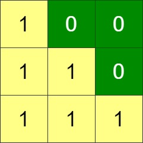

#### 1536. 排布二进制网格的最少交换次数

给你一个 `n x n` 的二进制网格 `grid`，每一次操作中，你可以选择网格的 **相邻两行** 进行交换。

一个符合要求的网格需要满足主对角线以上的格子全部都是 **0** 。

请你返回使网格满足要求的最少操作次数，如果无法使网格符合要求，请你返回 **-1** 。

主对角线指的是从 `(1, 1)` 到 `(n, n)` 的这些格子。

**示例 1：**


```shell
输入：grid = [[0,0,1],[1,1,0],[1,0,0]]
输出：3
```

**示例 2：**


```shell
输入：grid = [[0,1,1,0],[0,1,1,0],[0,1,1,0],[0,1,1,0]]
输出：-1
解释：所有行都是一样的，交换相邻行无法使网格符合要求。
```

**示例 3：**



```shell
输入：grid = [[1,0,0],[1,1,0],[1,1,1]]
输出：0
```

**提示：**

- `n == grid.length`
- `n == grid[i].length`
- `1 <= n <= 200`
- `grid[i][j]` 要么是 `0` 要么是 `1` 。


### 题解

### 思路

用`f[i]`记录每一行里面从右边开始数第一个1的位置。

要满足对角线以上的格子全部都是 0，必须满足:`f[i] <= i`

从第一行开始遍历：

- 如果这行满足`f[i] <= i`，就跳过，看下一行
- 否则，往下遍历后面的行，找到**最先**满足条件的，一行行换上去。交换并计算交换次数。

```java
class Solution {
    public int minSwaps(int[][] grid) {
        int n = grid.length;
        int[] f = new int[n];
        // 记录每一行里面从右边开始数第一个1的位置
        // 要满足对角线以上的格子全部都是 0，必须满足:f[i] <= i
        for(int i = 0; i < n; i++){
            for(int j = n-1; j >= 0; j--){
                if(grid[i][j] == 1){
                    f[i] = j;
                    break;
                }
            }
        }
        int ans = 0;
        int pos = 0;
        for(int i = 0; i < n; i++){
            if(f[i] <= i){
                continue;//这行已经符合条件了
            }
            //往下遍历后面的行，找到[最先]满足条件的，一行行换上去
            int j;
            for(j = i + 1; j < n; j++){
                if(f[j] <= i){ 
                    pos = j;//pos为最先满足条件的行数
                    break;
                }
            }
            if(j == n) return -1;//找不到满足条件的行
            //交换 并计算交换次数
            for(int k = pos; k > i; k--){
                //交换f[k-1]和f[k]
                int tmp = f[k-1];
                f[k-1] = f[k];
                f[k] = tmp;
            }
            ans += (pos - i);
        }
        return ans;
    }
}
```

